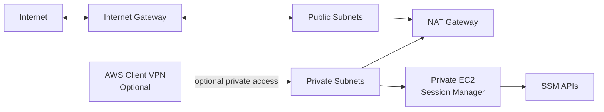

# FA01HC 공통 / VPC 네트워크 Foundation

NAT Gateway, Session Manager, AWS Client VPN 실습을 위한 기본 VPC 네트워크 프로젝트입니다.

강사는 이 프로젝트로 공통 네트워크를 빠르게 만들고, 수강생은 콘솔에서 route table, NAT Gateway, SSM 접속 흐름, Client VPN 연결 구조를 확인할 수 있습니다.

## 아키텍처



## 생성 리소스

| 구분 | 리소스 |
| --- | --- |
| VPC | DNS 지원이 켜진 단일 VPC |
| Public | AZ별 public subnet, public route table, Internet Gateway |
| Private | AZ별 private subnet, private route table |
| NAT | 단일 NAT Gateway와 Elastic IP |
| SSM | private EC2, IAM role/profile, Session Manager 접속 권한 |
| SSH Key | TLS provider로 생성한 EC2 key pair와 local PEM 파일 |
| VPC Endpoint | 선택 사항: `ssm`, `ssmmessages`, `ec2messages` interface endpoint |
| Client VPN | 선택 사항: Client VPN endpoint, subnet association, authorization rule |

## 사용 방법

```bash
make init LAB=terraform/fa01hc/common/01-vpc-network-foundation
make plan LAB=terraform/fa01hc/common/01-vpc-network-foundation
make lifecycle-apply-destroy LAB=terraform/fa01hc/common/01-vpc-network-foundation
```

직접 적용하려면 다음 명령을 사용합니다.

```bash
terraform -chdir=terraform/fa01hc/common/01-vpc-network-foundation apply
terraform -chdir=terraform/fa01hc/common/01-vpc-network-foundation destroy
```

NAT Gateway와 Client VPN은 시간당 비용이 발생합니다. 실습 후 반드시 `destroy`합니다.

## 수강생 실습 가이드

이 가이드는 이 Terraform 디렉토리에서 만든 VPC, private EC2, NAT Gateway, Session Manager 구성을 기준으로 진행합니다.

| 실습 | 가이드 |
| --- | --- |
| Session Manager 구성 확인 및 SSH 접속 | [Session Manager 구성해서 SSH 접속하기](guides/session-manager-ssh.md) |
| NAT Gateway 경로 검증 및 nginx 설치 | [NAT Gateway 구성해서 nginx 설치하기](guides/nat-nginx-session-manager.md) |
| Client VPN 구성 및 Windows/WSL 접속 | [VPN 구성해서 접속하기](guides/client-vpn-windows-wsl.md) |

## NAT Gateway 실습

기본값은 `enable_nat_gateway = true`입니다.

Private EC2는 public IP가 없지만 private route table의 `0.0.0.0/0` 경로가 NAT Gateway를 향하므로 외부 HTTPS 호출이 가능합니다.

Session Manager로 접속한 뒤 확인합니다.

```bash
curl -s https://checkip.amazonaws.com
```

콘솔에서 확인할 항목은 다음과 같습니다.

| 항목 | 확인 포인트 |
| --- | --- |
| Public route table | `0.0.0.0/0 -> Internet Gateway` |
| Private route table | `0.0.0.0/0 -> NAT Gateway` |
| NAT Gateway | Public subnet에 배치, Elastic IP 연결 |
| Private EC2 | Public IP 없음 |

## Session Manager 실습

Terraform output의 `session_manager_start_command`를 사용합니다.

```bash
aws ssm start-session --target <private_instance_id> --region us-east-1
```

AWS 콘솔에서는 **Systems Manager > Session Manager**에서 private EC2에 접속합니다.

Session Manager는 SSH key pair를 사용하지 않습니다. IAM role, SSM Agent, SSM API 통신 경로로 접속합니다. 이 프로젝트의 SSH key pair는 Client VPN으로 VPC에 연결한 뒤 private EC2로 SSH 접속을 테스트할 때 사용합니다.

NAT 없이 Session Manager만 실습하려면 아래처럼 바꿉니다.

```hcl
enable_nat_gateway       = false
enable_ssm_vpc_endpoints = true
```

이 경우 private EC2는 인터넷으로 나가지 않고 SSM interface endpoint를 통해 Systems Manager와 통신합니다.

## Client VPN 실습

Client VPN은 ACM에 등록된 서버 인증서가 필요하므로 기본값은 비활성화되어 있습니다.

`terraform.tfvars`에서 아래 값을 설정합니다.

```hcl
enable_client_vpn = true

client_vpn_server_certificate_arn     = "arn:aws:acm:us-east-1:111122223333:certificate/..."
client_vpn_root_certificate_chain_arn = "arn:aws:acm:us-east-1:111122223333:certificate/..."
```

생성 후 콘솔에서 **VPC > Client VPN endpoints**로 이동해 client configuration을 다운로드합니다.

기본 Client VPN 설정은 다음과 같습니다.

| 항목 | 값 |
| --- | --- |
| Client CIDR | `172.16.0.0/22` |
| 인증 방식 | Mutual certificate authentication |
| Split tunnel | Enabled |
| 연결 대상 | Private subnet association |
| 권한 규칙 | 기본값은 VPC CIDR, 필요 시 `client_vpn_authorization_cidr_blocks`로 확장 |

VPN 연결 후 private EC2의 private IP로 ping을 테스트합니다.

```bash
ping <private_instance_private_ip>
```

SSH도 테스트할 수 있습니다.

```bash
ssh -i generated/fa01hc-vpc-network-foundation-key.pem ec2-user@<private_instance_private_ip>
```

생성된 private key 파일은 `generated/` 아래에 저장되고 `.gitignore`로 제외됩니다. Terraform TLS provider로 키를 만드는 방식은 실습 자동화에는 편하지만 private key가 Terraform state에도 저장되므로 운영 환경에서는 기존 키 관리 체계나 Secrets Manager 같은 별도 보관 방식을 권장합니다.

## 주요 변수

| 변수 | 기본값 | 설명 |
| --- | --- | --- |
| `availability_zone_count` | `2` | 생성할 AZ 수 |
| `enable_nat_gateway` | `true` | NAT Gateway 생성 여부 |
| `enable_ssm_instance` | `true` | private EC2 생성 여부 |
| `enable_ssm_vpc_endpoints` | `false` | SSM interface endpoint 생성 여부 |
| `enable_ssh_key_pair` | `true` | SSH 테스트용 key pair 생성 여부 |
| `enable_client_vpn` | `false` | Client VPN 생성 여부 |
| `vpc_cidr` | `10.60.0.0/16` | VPC CIDR |

## 정리

Client VPN을 켰다면 Terraform destroy 전에 연결 중인 클라이언트를 종료합니다.

```bash
terraform -chdir=terraform/fa01hc/common/01-vpc-network-foundation destroy
```
