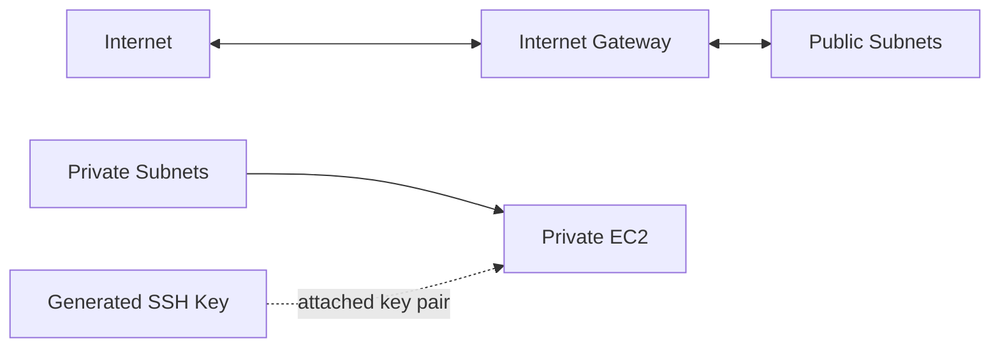

# FA01HC 공통 / VPC 네트워크 Foundation

수강생 실습을 위한 최소 VPC 네트워크 준비 프로젝트입니다.

이 Terraform 디렉토리는 VPC, subnet, route table, Internet Gateway, private EC2, SSH key만 생성합니다. NAT Gateway, Session Manager 구성, AWS Client VPN endpoint는 수강생이 각 가이드에서 직접 만들고 지우도록 분리했습니다.

## 아키텍처



## 생성 리소스

| 구분 | 리소스 |
| --- | --- |
| VPC | DNS 지원이 켜진 단일 VPC |
| Public | AZ별 public subnet, public route table, Internet Gateway |
| Private | AZ별 private subnet, private route table |
| EC2 | public IP가 없는 Amazon Linux 2023 private EC2 |
| SSH Key | TLS provider로 생성한 EC2 key pair와 local PEM 파일 |
| Security Group | Client VPN 실습 대역(`172.16.0.0/22`)에서 ICMP/SSH 허용 |

Terraform은 NAT Gateway, SSM IAM role, SSM VPC endpoint, Client VPN endpoint를 생성하지 않습니다.

## 바로 실습하기

수강생은 아래 명령부터 시작합니다.

```bash
git clone https://github.com/gasbugs/mulcam-aws-cloud-security-terraform.git
cd mulcam-aws-cloud-security-terraform

LAB_DIR=terraform/fa01hc/common/01-vpc-network-foundation

terraform -chdir="$LAB_DIR" init
terraform -chdir="$LAB_DIR" apply
```

이미 clone한 저장소가 있다면 최신 상태로 맞춘 뒤 진행합니다.

```bash
cd mulcam-aws-cloud-security-terraform
git pull

LAB_DIR=terraform/fa01hc/common/01-vpc-network-foundation
terraform -chdir="$LAB_DIR" init
terraform -chdir="$LAB_DIR" apply
```

생성 후 주요 출력값을 확인합니다.

```bash
cd terraform/fa01hc/common/01-vpc-network-foundation

terraform output vpc_id
terraform output private_subnet_ids
terraform output public_subnet_ids
terraform output private_instance_id
terraform output private_instance_private_ip
terraform output ssh_private_key_file
```

## 수강생 실습 가이드

각 가이드는 이 Terraform 디렉토리로 기본 VPC와 private EC2를 만든 뒤 진행합니다.

| 실습 | 수강생이 직접 만드는 리소스 | 가이드 |
| --- | --- | --- |
| Session Manager 구성 및 SSH 접속 | IAM role/profile, SSM interface endpoints | [Session Manager 구성해서 SSH 접속하기](guides/session-manager-ssh.md) |
| NAT Gateway 구성 및 nginx 설치 | Elastic IP, NAT Gateway, private route, SSM IAM role/profile | [NAT Gateway 구성해서 nginx 설치하기](guides/nat-nginx-session-manager.md) |
| Client VPN 구성 및 접속 | ACM certificate, Client VPN endpoint, association, authorization rule | [VPN 구성해서 접속하기](guides/client-vpn-windows-wsl.md) |

## 주요 변수

| 변수 | 기본값 | 설명 |
| --- | --- | --- |
| `availability_zone_count` | `2` | 생성할 AZ 수 |
| `client_vpn_client_cidr_block` | `172.16.0.0/22` | 수강생이 Client VPN을 만들 때 사용할 client CIDR |
| `generated_ssh_private_key_path` | `generated/fa01hc-vpc-network-foundation-key.pem` | 생성된 private key 저장 경로 |
| `instance_type` | `t3.micro` | private EC2 instance type |
| `vpc_cidr` | `10.60.0.0/16` | VPC CIDR |

생성된 private key 파일은 `generated/` 아래에 저장되고 `.gitignore`로 제외됩니다. Terraform TLS provider로 키를 만드는 방식은 실습 자동화에는 편하지만 private key가 Terraform state에도 저장되므로 운영 환경에서는 기존 키 관리 체계나 Secrets Manager 같은 별도 보관 방식을 사용합니다.

## 정리

각 가이드에서 직접 만든 NAT Gateway, SSM endpoint, Client VPN endpoint 같은 수동 리소스를 먼저 삭제합니다. 그 다음 Terraform 리소스를 삭제합니다.

```bash
terraform -chdir=terraform/fa01hc/common/01-vpc-network-foundation destroy
```
