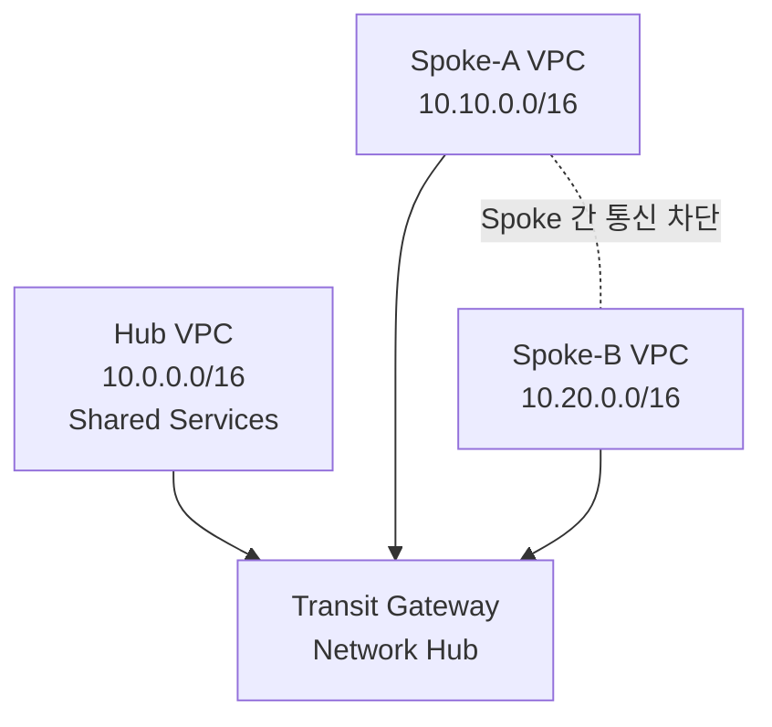

# 3일차 / Hub-and-Spoke Transit Gateway 연결

이 실습은 단순 VPC Peering 대신 Transit Gateway 기반 Hub-and-Spoke 구조를 구성합니다.
목표는 Hub VPC와 각 Spoke VPC는 통신할 수 있지만, Spoke VPC끼리는 통신하지 못하도록 라우팅을 분리하는 것입니다.

## 1. 실습 아키텍처



## 2. 실습 목표

| 구분 | 결과 |
| --- | --- |
| Spoke-A -> Hub | 허용 |
| Spoke-B -> Hub | 허용 |
| Hub -> Spoke-A | 허용 |
| Hub -> Spoke-B | 허용 |
| Spoke-A -> Spoke-B | 차단 |
| Spoke-B -> Spoke-A | 차단 |
| 접속 방식 | Public IP 없이 SSM Session Manager 사용 |
| IaC | Terraform |

VPC CIDR이 겹치면 Transit Gateway 경로 전파와 라우팅이 정상 동작하지 않습니다. 이 실습은 서로 겹치지 않는 `10.0.0.0/16`, `10.10.0.0/16`, `10.20.0.0/16` CIDR을 사용합니다.

## 3. 배포 리소스

| 리소스 | 구성 |
| --- | --- |
| VPC | Hub 1개, Spoke 2개 |
| Subnet | VPC별 private subnet 1개 |
| Transit Gateway | 기본 route table association/propagation 비활성화 |
| TGW Route Table | Hub 출발용 `from_hub`, Spoke 출발용 `from_spokes` |
| VPC Endpoint | VPC별 `ssm`, `ssmmessages`, `ec2messages` interface endpoint |
| EC2 | VPC별 SSM 테스트 인스턴스 1대 |
| IAM | SSM Session Manager용 instance profile |

## 4. 라우팅 구조

### Hub VPC Route Table

| Destination | Target |
| --- | --- |
| `10.0.0.0/16` | local |
| `10.10.0.0/16` | Transit Gateway |
| `10.20.0.0/16` | Transit Gateway |

### Spoke-A VPC Route Table

| Destination | Target |
| --- | --- |
| `10.10.0.0/16` | local |
| `10.0.0.0/16` | Transit Gateway |

### Spoke-B VPC Route Table

| Destination | Target |
| --- | --- |
| `10.20.0.0/16` | local |
| `10.0.0.0/16` | Transit Gateway |

### TGW Route Table: from_spokes

| Destination | Target |
| --- | --- |
| `10.0.0.0/16` | Hub attachment |
| `10.10.0.0/16` | Blackhole |
| `10.20.0.0/16` | Blackhole |

### TGW Route Table: from_hub

| Destination | Target |
| --- | --- |
| `10.10.0.0/16` | Spoke-A attachment |
| `10.20.0.0/16` | Spoke-B attachment |

Spoke VPC route table에는 다른 Spoke CIDR 경로를 넣지 않고, TGW `from_spokes` route table에는 Spoke CIDR blackhole route를 추가합니다. 그래서 운영자가 실수로 Spoke route table에 상대 Spoke CIDR을 추가하더라도 TGW에서 한 번 더 차단됩니다.

## 5. 배포

```bash
terraform init
terraform plan
terraform apply
```

이 레포의 helper를 사용할 수도 있습니다.

```bash
make plan LAB=terraform/fa01hc/day03-compute-and-network-security/07-vpc-peering
CONFIRM_APPLY_DESTROY=YES make lifecycle-apply-destroy LAB=terraform/fa01hc/day03-compute-and-network-security/07-vpc-peering
```

배포 후 주요 값을 확인합니다.

```bash
terraform output
```

## 6. SSM 관리 대상 확인

```bash
aws ssm describe-instance-information \
  --region us-east-1 \
  --query "InstanceInformationList[].{InstanceId:InstanceId,IP:IPAddress,PingStatus:PingStatus}" \
  --output table
```

`PingStatus`가 `Online`이면 SSM Run Command와 Session Manager를 사용할 수 있습니다.

## 7. 통신 테스트

### 7.1 Spoke-A -> Hub 허용 확인

```bash
HUB_IP=$(terraform output -json private_ips | jq -r '.hub')
SPOKE_A_ID=$(terraform output -json instance_ids | jq -r '."spoke-a"')

CMD_ID=$(aws ssm send-command \
  --region us-east-1 \
  --instance-ids "$SPOKE_A_ID" \
  --document-name "AWS-RunShellScript" \
  --parameters "{\"commands\":[\"ping -c 3 $HUB_IP\"]}" \
  --query "Command.CommandId" \
  --output text)

sleep 3

aws ssm get-command-invocation \
  --region us-east-1 \
  --command-id "$CMD_ID" \
  --instance-id "$SPOKE_A_ID" \
  --query "StandardOutputContent" \
  --output text
```

정상이라면 `3 packets transmitted, 3 received` 형태가 출력됩니다.

### 7.2 Hub -> Spoke-B 허용 확인

```bash
SPOKE_B_IP=$(terraform output -json private_ips | jq -r '."spoke-b"')
HUB_ID=$(terraform output -json instance_ids | jq -r '.hub')

CMD_ID=$(aws ssm send-command \
  --region us-east-1 \
  --instance-ids "$HUB_ID" \
  --document-name "AWS-RunShellScript" \
  --parameters "{\"commands\":[\"ping -c 3 $SPOKE_B_IP\"]}" \
  --query "Command.CommandId" \
  --output text)

sleep 3

aws ssm get-command-invocation \
  --region us-east-1 \
  --command-id "$CMD_ID" \
  --instance-id "$HUB_ID" \
  --query "StandardOutputContent" \
  --output text
```

### 7.3 Spoke-A -> Spoke-B 차단 확인

```bash
SPOKE_B_IP=$(terraform output -json private_ips | jq -r '."spoke-b"')
SPOKE_A_ID=$(terraform output -json instance_ids | jq -r '."spoke-a"')

CMD_ID=$(aws ssm send-command \
  --region us-east-1 \
  --instance-ids "$SPOKE_A_ID" \
  --document-name "AWS-RunShellScript" \
  --parameters "{\"commands\":[\"ping -c 3 $SPOKE_B_IP || true\"]}" \
  --query "Command.CommandId" \
  --output text)

sleep 3

aws ssm get-command-invocation \
  --region us-east-1 \
  --command-id "$CMD_ID" \
  --instance-id "$SPOKE_A_ID" \
  --query "StandardOutputContent" \
  --output text
```

이 테스트는 실패하는 것이 정상입니다. Spoke route table에 다른 Spoke CIDR 경로가 없고, TGW `from_spokes` route table에도 Spoke CIDR blackhole route가 있기 때문입니다.

## 8. 운영 환경 확장 포인트

| 확장 항목 | 설명 |
| --- | --- |
| Network Account | TGW를 별도 네트워크 계정에 배치 |
| AWS RAM | 중앙 TGW를 다른 계정 또는 AWS Organizations 계정에 공유 |
| Shared Services VPC | AD, DNS, Bastion, CI/CD Runner 배치 |
| Inspection VPC | AWS Network Firewall, IDS/IPS, Proxy 배치 |
| Central Egress | Spoke 인터넷 아웃바운드를 Hub 또는 Egress VPC로 집중 |
| TGW Route Table 분리 | 개발/운영/보안/공유서비스 경로를 분리 |

## 9. 비용 주의

Transit Gateway, TGW VPC attachment, Interface Endpoint, EC2 인스턴스는 비용이 발생합니다. 실습 후 반드시 삭제합니다.

```bash
terraform destroy
```

## 10. 추가 실습 과제

### 과제 1. Spoke 간 통신 허용으로 변경

다음 두 가지를 바꾸면 Spoke-A <-> Spoke-B 통신이 가능해집니다.

1. Spoke VPC route table에 상대 Spoke CIDR을 TGW로 보내는 경로 추가
2. TGW `from_spokes` route table의 blackhole route 제거 후 상대 Spoke attachment route 추가

### 과제 2. Central Egress 구성

Hub VPC에 NAT Gateway와 Internet Gateway를 만들고, Spoke의 `0.0.0.0/0`을 TGW로 보내면 중앙 인터넷 출구 구조를 만들 수 있습니다.

### 과제 3. Cross-Account Hub-and-Spoke

Network 계정에 TGW를 만들고, Application 계정의 Spoke VPC를 AWS RAM으로 공유받은 TGW에 attach하면 실제 기업형 Landing Zone 구조에 가까워집니다.
