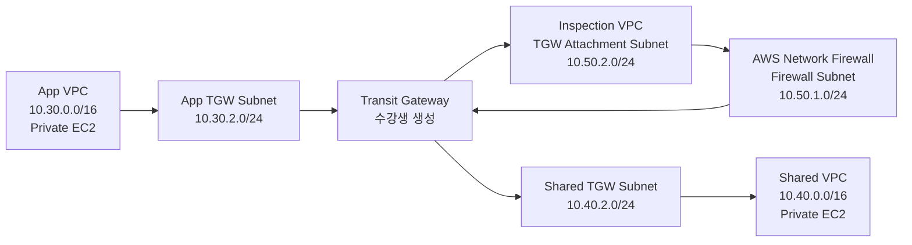

# 3일차 / TGW와 중앙 방화벽 Inspection AWS CLI 실습 준비 랩

이 실습은 강사가 Terraform으로 기본 네트워크만 먼저 준비하고, 수강생이 AWS CLI 명령으로 Transit Gateway, AWS Network Firewall, 라우팅을 직접 완성하는 랩입니다.

VPC Peering만으로는 `App VPC -> Firewall VPC -> Shared VPC`처럼 중간 VPC를 경유하는 통신을 만들 수 없습니다. VPC Peering은 transitive routing을 지원하지 않기 때문입니다. 그래서 중앙 방화벽을 실제 트래픽 경로에 넣으려면 Transit Gateway, Inspection VPC, AWS Network Firewall 구조가 필요합니다.

이 문서는 2026-06-20에 `us-east-1`에서 end-to-end로 검증했습니다. Terraform 기본 구성, 수강생 CLI 구성, App/Shared 양방향 ping, 전체 삭제까지 확인했습니다. 첫 번째 ping은 라우팅 반영 지연으로 실패할 수 있고, 1분 뒤 재시도하면 정상 성공할 수 있습니다.

## 1. 실습 구조



Terraform은 아래 리소스만 준비합니다.

| 리소스 | 구성 |
| --- | --- |
| VPC | App, Shared, Inspection |
| Subnet | App/Shared private subnet, App/Shared TGW subnet, Inspection firewall subnet, Inspection TGW subnet |
| Route Table | Workload private RT, Workload TGW RT, Inspection firewall RT, Inspection TGW RT |
| VPC Endpoint | App/Shared VPC의 SSM, ssmmessages, ec2messages endpoint |
| EC2 | App/Shared VPC의 private 테스트 인스턴스 |
| IAM | SSM 접속용 instance profile |

수강생은 아래 리소스를 직접 만듭니다.

- Transit Gateway
- TGW VPC attachment
- TGW route table, association, route
- AWS Network Firewall rule group
- AWS Network Firewall policy
- AWS Network Firewall
- VPC route table의 TGW 및 firewall endpoint route

## 2. 실습 전 확인

모든 명령은 bash 또는 zsh 기준입니다. `AWS_PAGER`를 비워두면 AWS CLI가 결과를 별도 pager로 열지 않아 실습 흐름이 끊기지 않습니다.

```bash
aws --version
terraform version

export AWS_PAGER=""
export AWS_REGION=us-east-1
```

실습용 profile을 쓸 경우 먼저 자격 증명을 등록합니다. 실습 계정 CSV에 session token이 있으면 마지막 명령도 같이 실행합니다.

```bash
aws configure --profile fa01hc
aws configure set aws_session_token "CSV의 session token 값" --profile fa01hc

export AWS_PROFILE=fa01hc
aws sts get-caller-identity
```

`aws sts get-caller-identity`는 현재 CLI가 어떤 계정으로 실행되는지 확인하는 명령입니다. 여기서 실패하면 Terraform과 뒤의 AWS CLI 명령도 같은 이유로 실패합니다.

## 3. 강사용 Terraform 준비

강사는 Terraform으로 실습 바닥 구성을 만듭니다. 이 단계가 끝나면 수강생이 쓸 VPC ID, subnet ID, route table ID, EC2 private IP가 output으로 나옵니다.

```bash
git clone https://github.com/gasbugs/mulcam-aws-cloud-security-terraform.git
cd mulcam-aws-cloud-security-terraform

LAB_DIR=terraform/fa01hc/day03-compute-and-network-security/08-vpc-peering-console-workshop
cd "$LAB_DIR"

terraform init
terraform apply
```

수강생 명령에서 계속 쓸 값을 환경변수 파일로 저장합니다. 강사는 이 파일 내용을 수강생에게 전달하거나, 수강생이 같은 Terraform 디렉토리에서 직접 생성하게 합니다.

```bash
terraform output -raw cli_export_commands > /tmp/fa01hc-inspection-firewall.env
source /tmp/fa01hc-inspection-firewall.env

env | grep -E '^(APP_|SHARED_|INSPECTION_|TGW_|FIREWALL_|NETWORK_|AWS_REGION=|PROJECT_NAME=)' | sort
```

Terraform apply 직후에는 EC2 instance profile과 SSM endpoint DNS 반영이 늦을 수 있습니다. 아래 명령은 App/Shared 인스턴스가 SSM 명령을 받을 수 있는 상태인지 확인합니다.

```bash
aws ec2 wait instance-status-ok \
  --instance-ids "$APP_INSTANCE_ID" "$SHARED_INSTANCE_ID" \
  --region "$AWS_REGION"

aws ssm describe-instance-information \
  --filters "Key=InstanceIds,Values=$APP_INSTANCE_ID,$SHARED_INSTANCE_ID" \
  --query "InstanceInformationList[].{Id:InstanceId,Status:PingStatus}" \
  --output table \
  --region "$AWS_REGION"
```

`PingStatus`가 `Online`이면 SSM Run Command를 실행할 준비가 된 것입니다. `None` 또는 빈 값이면 1-2분 뒤 다시 확인합니다.

## 4. Transit Gateway 생성

Transit Gateway는 여러 VPC를 연결하는 중앙 라우터 역할을 합니다. 기본 route table 자동 연결과 자동 전파를 꺼서, 실습자가 어떤 attachment가 어떤 route table을 쓰는지 직접 제어하게 합니다.

```bash
TGW_ID=$(aws ec2 create-transit-gateway \
  --description "$PROJECT_NAME centralized inspection transit gateway" \
  --options "AmazonSideAsn=64512,AutoAcceptSharedAttachments=disable,DefaultRouteTableAssociation=disable,DefaultRouteTablePropagation=disable,DnsSupport=enable,VpnEcmpSupport=enable" \
  --tag-specifications "ResourceType=transit-gateway,Tags=[{Key=Name,Value=$TGW_NAME},{Key=Course,Value=FA01HC},{Key=Unit,Value=inspection-firewall-cli}]" \
  --query "TransitGateway.TransitGatewayId" \
  --output text \
  --region "$AWS_REGION")

echo "$TGW_ID"
```

생성 직후에는 `pending`입니다. `available`이 되어야 attachment와 route table을 안정적으로 만들 수 있습니다.

```bash
for i in {1..40}; do
  TGW_STATE=$(aws ec2 describe-transit-gateways \
    --transit-gateway-ids "$TGW_ID" \
    --query "TransitGateways[0].State" \
    --output text \
    --region "$AWS_REGION")
  echo "$TGW_STATE"
  [ "$TGW_STATE" = "available" ] && break
  sleep 15
done

[ "$TGW_STATE" = "available" ] || exit 1
```

## 5. TGW VPC Attachment 생성

Attachment는 VPC를 TGW에 꽂는 연결부입니다. App과 Shared는 일반 attachment로 만들고, Inspection attachment만 appliance mode를 켭니다. appliance mode는 방화벽처럼 중간 장비를 지나는 트래픽의 왕복 경로를 안정적으로 유지하는 설정입니다.

```bash
APP_TGW_ATTACHMENT_ID=$(aws ec2 create-transit-gateway-vpc-attachment \
  --transit-gateway-id "$TGW_ID" \
  --vpc-id "$APP_VPC_ID" \
  --subnet-ids "$APP_TGW_SUBNET_ID" \
  --tag-specifications "ResourceType=transit-gateway-attachment,Tags=[{Key=Name,Value=$TGW_APP_ATTACHMENT_NAME},{Key=Course,Value=FA01HC},{Key=Unit,Value=inspection-firewall-cli}]" \
  --query "TransitGatewayVpcAttachment.TransitGatewayAttachmentId" \
  --output text \
  --region "$AWS_REGION")

SHARED_TGW_ATTACHMENT_ID=$(aws ec2 create-transit-gateway-vpc-attachment \
  --transit-gateway-id "$TGW_ID" \
  --vpc-id "$SHARED_VPC_ID" \
  --subnet-ids "$SHARED_TGW_SUBNET_ID" \
  --tag-specifications "ResourceType=transit-gateway-attachment,Tags=[{Key=Name,Value=$TGW_SHARED_ATTACHMENT_NAME},{Key=Course,Value=FA01HC},{Key=Unit,Value=inspection-firewall-cli}]" \
  --query "TransitGatewayVpcAttachment.TransitGatewayAttachmentId" \
  --output text \
  --region "$AWS_REGION")
```

```bash
INSPECTION_TGW_ATTACHMENT_ID=$(aws ec2 create-transit-gateway-vpc-attachment \
  --transit-gateway-id "$TGW_ID" \
  --vpc-id "$INSPECTION_VPC_ID" \
  --subnet-ids "$INSPECTION_TGW_SUBNET_ID" \
  --options ApplianceModeSupport=enable \
  --tag-specifications "ResourceType=transit-gateway-attachment,Tags=[{Key=Name,Value=$TGW_INSPECTION_ATTACHMENT_NAME},{Key=Course,Value=FA01HC},{Key=Unit,Value=inspection-firewall-cli}]" \
  --query "TransitGatewayVpcAttachment.TransitGatewayAttachmentId" \
  --output text \
  --region "$AWS_REGION")

printf "%s\n" "$APP_TGW_ATTACHMENT_ID" "$SHARED_TGW_ATTACHMENT_ID" "$INSPECTION_TGW_ATTACHMENT_ID"
```

세 attachment가 모두 `available`이 될 때까지 기다립니다. 하나라도 `failed`가 나오면 VPC ID와 subnet ID를 잘못 넣은 것입니다.

```bash
for attachment_id in "$APP_TGW_ATTACHMENT_ID" "$SHARED_TGW_ATTACHMENT_ID" "$INSPECTION_TGW_ATTACHMENT_ID"; do
  for i in {1..40}; do
    state=$(aws ec2 describe-transit-gateway-vpc-attachments \
      --transit-gateway-attachment-ids "$attachment_id" \
      --query "TransitGatewayVpcAttachments[0].State" \
      --output text \
      --region "$AWS_REGION")
    echo "$attachment_id $state"
    [ "$state" = "available" ] && break
    [ "$state" = "failed" ] && exit 1
    sleep 15
  done
done
```

## 6. TGW Route Table 생성과 연결

TGW route table은 TGW 안에서 목적지를 판단하는 표입니다. 이 실습에서는 workload에서 출발한 트래픽용 route table과, inspection을 통과한 뒤 최종 목적지로 보내는 route table을 분리합니다.

```bash
WORKLOAD_TGW_RT_ID=$(aws ec2 create-transit-gateway-route-table \
  --transit-gateway-id "$TGW_ID" \
  --tag-specifications "ResourceType=transit-gateway-route-table,Tags=[{Key=Name,Value=$TGW_FROM_WORKLOADS_RT_NAME},{Key=Course,Value=FA01HC},{Key=Unit,Value=inspection-firewall-cli}]" \
  --query "TransitGatewayRouteTable.TransitGatewayRouteTableId" \
  --output text \
  --region "$AWS_REGION")

INSPECTION_TGW_RT_ID_STUDENT=$(aws ec2 create-transit-gateway-route-table \
  --transit-gateway-id "$TGW_ID" \
  --tag-specifications "ResourceType=transit-gateway-route-table,Tags=[{Key=Name,Value=$TGW_FROM_INSPECTION_RT_NAME},{Key=Course,Value=FA01HC},{Key=Unit,Value=inspection-firewall-cli}]" \
  --query "TransitGatewayRouteTable.TransitGatewayRouteTableId" \
  --output text \
  --region "$AWS_REGION")

printf "%s\n" "$WORKLOAD_TGW_RT_ID" "$INSPECTION_TGW_RT_ID_STUDENT"
```

association은 attachment가 사용할 TGW route table을 정하는 작업입니다. App/Shared에서 출발하는 트래픽은 workload route table을 보고, Inspection에서 TGW로 돌아오는 트래픽은 inspection route table을 봅니다.

```bash
aws ec2 associate-transit-gateway-route-table \
  --transit-gateway-route-table-id "$WORKLOAD_TGW_RT_ID" \
  --transit-gateway-attachment-id "$APP_TGW_ATTACHMENT_ID" \
  --region "$AWS_REGION"

aws ec2 associate-transit-gateway-route-table \
  --transit-gateway-route-table-id "$WORKLOAD_TGW_RT_ID" \
  --transit-gateway-attachment-id "$SHARED_TGW_ATTACHMENT_ID" \
  --region "$AWS_REGION"

aws ec2 associate-transit-gateway-route-table \
  --transit-gateway-route-table-id "$INSPECTION_TGW_RT_ID_STUDENT" \
  --transit-gateway-attachment-id "$INSPECTION_TGW_ATTACHMENT_ID" \
  --region "$AWS_REGION"
```

association이 빠지면 TGW route가 있어도 트래픽이 올바른 route table을 보지 못합니다. 아래 출력에서 App/Shared attachment는 workload route table에, Inspection attachment는 inspection route table에 `associated`로 보여야 합니다.

```bash
aws ec2 get-transit-gateway-route-table-associations \
  --transit-gateway-route-table-id "$WORKLOAD_TGW_RT_ID" \
  --query "Associations[].{Attachment:TransitGatewayAttachmentId,ResourceId:ResourceId,State:State}" \
  --output table \
  --region "$AWS_REGION"

aws ec2 get-transit-gateway-route-table-associations \
  --transit-gateway-route-table-id "$INSPECTION_TGW_RT_ID_STUDENT" \
  --query "Associations[].{Attachment:TransitGatewayAttachmentId,ResourceId:ResourceId,State:State}" \
  --output table \
  --region "$AWS_REGION"
```

## 7. Network Firewall Rule Group 생성

Rule group은 방화벽 규칙 모음입니다. 여기서는 ICMP, 즉 ping 트래픽만 App CIDR과 Shared CIDR 사이에서 허용합니다. 다른 트래픽은 뒤에서 policy 기본 동작으로 차단됩니다.

```bash
cat > /tmp/fa01hc-icmp-stateful-rule-group.json <<EOF
{
  "RulesSource": {
    "RulesString": "pass icmp $APP_CIDR any -> $SHARED_CIDR any (msg:\"Allow app to shared ICMP\"; sid:1001; rev:1;)\\npass icmp $SHARED_CIDR any -> $APP_CIDR any (msg:\"Allow shared to app ICMP\"; sid:1002; rev:1;)"
  },
  "StatefulRuleOptions": {
    "RuleOrder": "STRICT_ORDER"
  }
}
EOF
```

```bash
RULE_GROUP_ARN=$(aws network-firewall create-rule-group \
  --rule-group-name "$FIREWALL_RULE_GROUP_NAME" \
  --type STATEFUL \
  --capacity 100 \
  --rule-group file:///tmp/fa01hc-icmp-stateful-rule-group.json \
  --tags Key=Course,Value=FA01HC Key=Unit,Value=inspection-firewall-cli \
  --query "RuleGroupResponse.RuleGroupArn" \
  --output text \
  --region "$AWS_REGION")

echo "$RULE_GROUP_ARN"
```

## 8. Firewall Policy 생성

Firewall policy는 rule group을 실제 방화벽에 연결하는 설정입니다. stateless 단계는 stateful engine으로 넘기고, stateful 단계에서는 규칙에 맞지 않는 트래픽을 차단합니다.

```bash
cat > /tmp/fa01hc-firewall-policy.json <<EOF
{
  "StatelessDefaultActions": ["aws:forward_to_sfe"],
  "StatelessFragmentDefaultActions": ["aws:forward_to_sfe"],
  "StatefulEngineOptions": {"RuleOrder": "STRICT_ORDER"},
  "StatefulDefaultActions": ["aws:drop_strict"],
  "StatefulRuleGroupReferences": [
    {"ResourceArn": "$RULE_GROUP_ARN", "Priority": 100}
  ]
}
EOF
```

```bash
FIREWALL_POLICY_ARN=$(aws network-firewall create-firewall-policy \
  --firewall-policy-name "$FIREWALL_POLICY_NAME" \
  --firewall-policy file:///tmp/fa01hc-firewall-policy.json \
  --tags Key=Course,Value=FA01HC Key=Unit,Value=inspection-firewall-cli \
  --query "FirewallPolicyResponse.FirewallPolicyArn" \
  --output text \
  --region "$AWS_REGION")

echo "$FIREWALL_POLICY_ARN"
```

## 9. Network Firewall 생성

Network Firewall은 Inspection VPC의 firewall subnet에 endpoint를 만듭니다. 이 endpoint가 실제 패킷이 통과하는 방화벽 입구입니다.

```bash
FIREWALL_ARN=$(aws network-firewall create-firewall \
  --firewall-name "$NETWORK_FIREWALL_NAME" \
  --firewall-policy-arn "$FIREWALL_POLICY_ARN" \
  --vpc-id "$INSPECTION_VPC_ID" \
  --subnet-mappings "SubnetId=$INSPECTION_FIREWALL_SUBNET_ID" \
  --no-delete-protection \
  --no-subnet-change-protection \
  --no-firewall-policy-change-protection \
  --tags Key=Course,Value=FA01HC Key=Unit,Value=inspection-firewall-cli \
  --query "Firewall.FirewallArn" \
  --output text \
  --region "$AWS_REGION")

echo "$FIREWALL_ARN"
```

Firewall과 endpoint가 모두 `READY`가 되어야 라우팅에 endpoint ID를 넣을 수 있습니다. 테스트에서는 이 단계가 몇 분 걸렸습니다.

```bash
for i in {1..60}; do
  FIREWALL_STATUS=$(aws network-firewall describe-firewall \
    --firewall-name "$NETWORK_FIREWALL_NAME" \
    --query "FirewallStatus.Status" --output text --region "$AWS_REGION")
  FIREWALL_ENDPOINT_STATUS=$(aws network-firewall describe-firewall \
    --firewall-name "$NETWORK_FIREWALL_NAME" \
    --query "FirewallStatus.SyncStates.\"$INSPECTION_FIREWALL_AZ\".Attachment.Status" \
    --output text --region "$AWS_REGION")
  echo "$FIREWALL_STATUS $FIREWALL_ENDPOINT_STATUS"
  [ "$FIREWALL_STATUS" = "READY" ] && [ "$FIREWALL_ENDPOINT_STATUS" = "READY" ] && break
  sleep 20
done
```

```bash
FIREWALL_ENDPOINT_ID=$(aws network-firewall describe-firewall \
  --firewall-name "$NETWORK_FIREWALL_NAME" \
  --query "FirewallStatus.SyncStates.\"$INSPECTION_FIREWALL_AZ\".Attachment.EndpointId" \
  --output text \
  --region "$AWS_REGION")

echo "$FIREWALL_ENDPOINT_ID"
```

## 10. 라우팅 구성

라우팅은 왕복 경로가 모두 맞아야 합니다. App/Shared private subnet은 상대 VPC CIDR을 TGW로 보내고, TGW는 workload 트래픽을 먼저 Inspection attachment로 보냅니다.

```bash
aws ec2 create-route \
  --route-table-id "$APP_PRIVATE_RT_ID" \
  --destination-cidr-block "$SHARED_CIDR" \
  --transit-gateway-id "$TGW_ID" \
  --region "$AWS_REGION"

aws ec2 create-route \
  --route-table-id "$SHARED_PRIVATE_RT_ID" \
  --destination-cidr-block "$APP_CIDR" \
  --transit-gateway-id "$TGW_ID" \
  --region "$AWS_REGION"

aws ec2 create-transit-gateway-route \
  --transit-gateway-route-table-id "$WORKLOAD_TGW_RT_ID" \
  --destination-cidr-block "0.0.0.0/0" \
  --transit-gateway-attachment-id "$INSPECTION_TGW_ATTACHMENT_ID" \
  --region "$AWS_REGION"
```

Inspection VPC 안에서는 TGW subnet으로 들어온 트래픽을 Firewall endpoint로 보냅니다. Firewall subnet에서 나온 트래픽은 다시 TGW로 돌아가야 최종 목적지 VPC로 갈 수 있습니다.

```bash
aws ec2 create-route \
  --route-table-id "$INSPECTION_TGW_RT_ID" \
  --destination-cidr-block "0.0.0.0/0" \
  --vpc-endpoint-id "$FIREWALL_ENDPOINT_ID" \
  --region "$AWS_REGION"

aws ec2 create-route \
  --route-table-id "$INSPECTION_FIREWALL_RT_ID" \
  --destination-cidr-block "0.0.0.0/0" \
  --transit-gateway-id "$TGW_ID" \
  --region "$AWS_REGION"
```

Inspection attachment를 통해 TGW로 돌아온 트래픽은 실제 목적지인 App 또는 Shared attachment로 보내야 합니다.

```bash
aws ec2 create-transit-gateway-route \
  --transit-gateway-route-table-id "$INSPECTION_TGW_RT_ID_STUDENT" \
  --destination-cidr-block "$APP_CIDR" \
  --transit-gateway-attachment-id "$APP_TGW_ATTACHMENT_ID" \
  --region "$AWS_REGION"

aws ec2 create-transit-gateway-route \
  --transit-gateway-route-table-id "$INSPECTION_TGW_RT_ID_STUDENT" \
  --destination-cidr-block "$SHARED_CIDR" \
  --transit-gateway-attachment-id "$SHARED_TGW_ATTACHMENT_ID" \
  --region "$AWS_REGION"
```

라우팅이 데이터 플레인에 반영될 시간을 줍니다. 테스트에서는 120초 대기 후 첫 App -> Shared ping이 실패했고, 1분 뒤 재시도에서 성공했습니다.

```bash
aws ec2 describe-route-tables \
  --route-table-ids "$APP_PRIVATE_RT_ID" "$SHARED_PRIVATE_RT_ID" "$INSPECTION_TGW_RT_ID" "$INSPECTION_FIREWALL_RT_ID" \
  --query "RouteTables[].{RouteTableId:RouteTableId,Routes:Routes[].{Destination:DestinationCidrBlock,GatewayId:GatewayId,TransitGatewayId:TransitGatewayId,State:State}}" \
  --output table \
  --region "$AWS_REGION"
```

Network Firewall endpoint route는 출력에서 `VpcEndpointId`가 아니라 `GatewayId=vpce-...`로 보일 수 있습니다. `INSPECTION_TGW_RT_ID`의 `0.0.0.0/0` 대상이 Firewall endpoint이고, `INSPECTION_FIREWALL_RT_ID`의 `0.0.0.0/0` 대상이 TGW이면 정상입니다.

```bash
aws ec2 search-transit-gateway-routes \
  --transit-gateway-route-table-id "$WORKLOAD_TGW_RT_ID" \
  --filters "Name=state,Values=active" \
  --output table \
  --region "$AWS_REGION"

aws ec2 search-transit-gateway-routes \
  --transit-gateway-route-table-id "$INSPECTION_TGW_RT_ID_STUDENT" \
  --filters "Name=state,Values=active" \
  --output table \
  --region "$AWS_REGION"

sleep 120
```

## 11. 통신 테스트

SSM Run Command로 private EC2 안에서 ping을 실행합니다. 인스턴스에는 public IP가 없으므로 로컬 PC에서 직접 ping하는 방식이 아닙니다.

```bash
command_id=$(aws ssm send-command \
  --instance-ids "$APP_INSTANCE_ID" \
  --document-name "AWS-RunShellScript" \
  --parameters "commands=ping -c 5 $SHARED_PRIVATE_IP" \
  --query "Command.CommandId" \
  --output text \
  --region "$AWS_REGION")

aws ssm wait command-executed \
  --command-id "$command_id" \
  --instance-id "$APP_INSTANCE_ID" \
  --region "$AWS_REGION" || true
```

```bash
aws ssm get-command-invocation \
  --command-id "$command_id" \
  --instance-id "$APP_INSTANCE_ID" \
  --query "{Status:Status,Output:StandardOutputContent,Error:StandardErrorContent}" \
  --output text \
  --region "$AWS_REGION"
```

반대 방향도 확인합니다. 양방향이 모두 성공해야 route가 제대로 맞은 것입니다.

```bash
command_id=$(aws ssm send-command \
  --instance-ids "$SHARED_INSTANCE_ID" \
  --document-name "AWS-RunShellScript" \
  --parameters "commands=ping -c 5 $APP_PRIVATE_IP" \
  --query "Command.CommandId" \
  --output text \
  --region "$AWS_REGION")

aws ssm wait command-executed \
  --command-id "$command_id" \
  --instance-id "$SHARED_INSTANCE_ID" \
  --region "$AWS_REGION" || true
```

```bash
aws ssm get-command-invocation \
  --command-id "$command_id" \
  --instance-id "$SHARED_INSTANCE_ID" \
  --query "{Status:Status,Output:StandardOutputContent,Error:StandardErrorContent}" \
  --output text \
  --region "$AWS_REGION"
```

정상 결과는 `5 packets transmitted, 5 received, 0% packet loss`입니다. 첫 시도에서 `100% packet loss`가 나오면 1분 뒤 같은 명령을 다시 실행합니다.

## 12. 문제 해결

| 증상 | 확인할 항목 |
| --- | --- |
| SSM 명령이 실패함 | EC2 running 상태, SSM Agent `Online`, SSM endpoint 상태 |
| TGW attachment가 `available`이 아님 | attachment subnet ID와 VPC ID가 올바른지 확인 |
| Network Firewall이 `READY`가 아님 | firewall subnet, firewall policy ARN, rule group 상태 |
| `FIREWALL_ENDPOINT_ID`가 `None` | Firewall endpoint attachment가 `READY`가 될 때까지 대기 |
| ping timeout | Workload private route table이 TGW를 가리키는지 확인 |
| ping timeout | TGW workload route table이 Inspection attachment를 가리키는지 확인 |
| ping timeout | Inspection TGW subnet route table이 Firewall endpoint를 가리키는지 확인 |
| ping timeout | Inspection firewall subnet route table이 TGW를 가리키는지 확인 |
| 한 방향만 성공 | 반대 방향 TGW route 또는 VPC route 누락 확인 |

## 13. AWS CLI 리소스 정리

수강생이 AWS CLI로 만든 리소스는 Terraform state에 없습니다. 반드시 먼저 CLI 리소스를 삭제하고, 마지막에 Terraform 리소스를 삭제합니다.

```bash
source /tmp/fa01hc-inspection-firewall.env
export AWS_PAGER=""
```

같은 터미널을 계속 쓰고 있다면 아래 ID 변수들이 이미 있습니다. 새 터미널이면 태그 이름으로 다시 조회합니다.

```bash
TGW_ID=${TGW_ID:-$(aws ec2 describe-transit-gateways \
  --filters "Name=tag:Name,Values=$TGW_NAME" \
  --query "TransitGateways[?State!='deleted'].TransitGatewayId | [0]" \
  --output text --region "$AWS_REGION")}

WORKLOAD_TGW_RT_ID=${WORKLOAD_TGW_RT_ID:-$(aws ec2 describe-transit-gateway-route-tables \
  --filters "Name=tag:Name,Values=$TGW_FROM_WORKLOADS_RT_NAME" \
  --query "TransitGatewayRouteTables[?State!='deleted'].TransitGatewayRouteTableId | [0]" \
  --output text --region "$AWS_REGION")}

INSPECTION_TGW_RT_ID_STUDENT=${INSPECTION_TGW_RT_ID_STUDENT:-$(aws ec2 describe-transit-gateway-route-tables \
  --filters "Name=tag:Name,Values=$TGW_FROM_INSPECTION_RT_NAME" \
  --query "TransitGatewayRouteTables[?State!='deleted'].TransitGatewayRouteTableId | [0]" \
  --output text --region "$AWS_REGION")}
```

```bash
APP_TGW_ATTACHMENT_ID=${APP_TGW_ATTACHMENT_ID:-$(aws ec2 describe-transit-gateway-vpc-attachments \
  --filters "Name=tag:Name,Values=$TGW_APP_ATTACHMENT_NAME" \
  --query "TransitGatewayVpcAttachments[?State!='deleted'].TransitGatewayAttachmentId | [0]" \
  --output text --region "$AWS_REGION")}

SHARED_TGW_ATTACHMENT_ID=${SHARED_TGW_ATTACHMENT_ID:-$(aws ec2 describe-transit-gateway-vpc-attachments \
  --filters "Name=tag:Name,Values=$TGW_SHARED_ATTACHMENT_NAME" \
  --query "TransitGatewayVpcAttachments[?State!='deleted'].TransitGatewayAttachmentId | [0]" \
  --output text --region "$AWS_REGION")}

INSPECTION_TGW_ATTACHMENT_ID=${INSPECTION_TGW_ATTACHMENT_ID:-$(aws ec2 describe-transit-gateway-vpc-attachments \
  --filters "Name=tag:Name,Values=$TGW_INSPECTION_ATTACHMENT_NAME" \
  --query "TransitGatewayVpcAttachments[?State!='deleted'].TransitGatewayAttachmentId | [0]" \
  --output text --region "$AWS_REGION")}
```

먼저 route를 삭제합니다. route가 남아 있으면 attachment나 TGW 삭제가 막힐 수 있습니다.

```bash
aws ec2 delete-route --route-table-id "$APP_PRIVATE_RT_ID" --destination-cidr-block "$SHARED_CIDR" --region "$AWS_REGION" || true
aws ec2 delete-route --route-table-id "$SHARED_PRIVATE_RT_ID" --destination-cidr-block "$APP_CIDR" --region "$AWS_REGION" || true
aws ec2 delete-route --route-table-id "$INSPECTION_TGW_RT_ID" --destination-cidr-block "0.0.0.0/0" --region "$AWS_REGION" || true
aws ec2 delete-route --route-table-id "$INSPECTION_FIREWALL_RT_ID" --destination-cidr-block "0.0.0.0/0" --region "$AWS_REGION" || true

aws ec2 delete-transit-gateway-route --transit-gateway-route-table-id "$WORKLOAD_TGW_RT_ID" --destination-cidr-block "0.0.0.0/0" --region "$AWS_REGION" || true
aws ec2 delete-transit-gateway-route --transit-gateway-route-table-id "$INSPECTION_TGW_RT_ID_STUDENT" --destination-cidr-block "$APP_CIDR" --region "$AWS_REGION" || true
aws ec2 delete-transit-gateway-route --transit-gateway-route-table-id "$INSPECTION_TGW_RT_ID_STUDENT" --destination-cidr-block "$SHARED_CIDR" --region "$AWS_REGION" || true
```

association을 해제합니다. association은 attachment와 TGW route table의 연결 관계입니다.

```bash
aws ec2 disassociate-transit-gateway-route-table \
  --transit-gateway-route-table-id "$WORKLOAD_TGW_RT_ID" \
  --transit-gateway-attachment-id "$APP_TGW_ATTACHMENT_ID" \
  --region "$AWS_REGION" || true

aws ec2 disassociate-transit-gateway-route-table \
  --transit-gateway-route-table-id "$WORKLOAD_TGW_RT_ID" \
  --transit-gateway-attachment-id "$SHARED_TGW_ATTACHMENT_ID" \
  --region "$AWS_REGION" || true

aws ec2 disassociate-transit-gateway-route-table \
  --transit-gateway-route-table-id "$INSPECTION_TGW_RT_ID_STUDENT" \
  --transit-gateway-attachment-id "$INSPECTION_TGW_ATTACHMENT_ID" \
  --region "$AWS_REGION" || true
```

Network Firewall은 삭제가 몇 분 걸릴 수 있습니다. Firewall 삭제가 끝난 뒤 policy와 rule group을 삭제합니다.

```bash
aws network-firewall delete-firewall \
  --firewall-name "$NETWORK_FIREWALL_NAME" \
  --region "$AWS_REGION" || true

for i in {1..40}; do
  aws network-firewall describe-firewall \
    --firewall-name "$NETWORK_FIREWALL_NAME" \
    --region "$AWS_REGION" >/dev/null 2>&1 || break
  echo "waiting for firewall deletion"
  sleep 30
done
```

```bash
aws network-firewall delete-firewall-policy \
  --firewall-policy-name "$FIREWALL_POLICY_NAME" \
  --region "$AWS_REGION" || true

for i in {1..20}; do
  aws network-firewall delete-rule-group \
    --rule-group-name "$FIREWALL_RULE_GROUP_NAME" \
    --type STATEFUL \
    --region "$AWS_REGION" && break
  echo "waiting for rule group release"
  sleep 30
done
```

TGW attachment를 삭제합니다. attachment가 `deleted`가 될 때까지 기다린 뒤 route table과 TGW를 삭제합니다.

```bash
aws ec2 delete-transit-gateway-vpc-attachment --transit-gateway-attachment-id "$APP_TGW_ATTACHMENT_ID" --region "$AWS_REGION" || true
aws ec2 delete-transit-gateway-vpc-attachment --transit-gateway-attachment-id "$SHARED_TGW_ATTACHMENT_ID" --region "$AWS_REGION" || true
aws ec2 delete-transit-gateway-vpc-attachment --transit-gateway-attachment-id "$INSPECTION_TGW_ATTACHMENT_ID" --region "$AWS_REGION" || true

for attachment_id in "$APP_TGW_ATTACHMENT_ID" "$SHARED_TGW_ATTACHMENT_ID" "$INSPECTION_TGW_ATTACHMENT_ID"; do
  for i in {1..40}; do
    state=$(aws ec2 describe-transit-gateway-vpc-attachments \
      --transit-gateway-attachment-ids "$attachment_id" \
      --query "TransitGatewayVpcAttachments[0].State" \
      --output text --region "$AWS_REGION" 2>/dev/null || echo deleted)
    echo "$attachment_id $state"
    [ "$state" = "deleted" ] && break
    sleep 15
  done
done
```

```bash
aws ec2 delete-transit-gateway-route-table \
  --transit-gateway-route-table-id "$WORKLOAD_TGW_RT_ID" \
  --region "$AWS_REGION" || true

aws ec2 delete-transit-gateway-route-table \
  --transit-gateway-route-table-id "$INSPECTION_TGW_RT_ID_STUDENT" \
  --region "$AWS_REGION" || true

sleep 20

aws ec2 delete-transit-gateway \
  --transit-gateway-id "$TGW_ID" \
  --region "$AWS_REGION" || true
```

마지막으로 Terraform 리소스를 삭제합니다.

```bash
terraform destroy
```

## 14. 정리 확인

아래 명령 결과가 비어 있거나 `ResourceNotFound`이면 실습 리소스가 정리된 것입니다.

```bash
terraform state list

aws ec2 describe-vpcs \
  --filters "Name=tag:Name,Values=fa01hc-inspection-firewall-cli-*" \
  --region "$AWS_REGION"
```

```bash
aws network-firewall describe-firewall \
  --firewall-name "$NETWORK_FIREWALL_NAME" \
  --region "$AWS_REGION"

aws network-firewall describe-rule-group \
  --rule-group-name "$FIREWALL_RULE_GROUP_NAME" \
  --type STATEFUL \
  --region "$AWS_REGION"
```

## 15. 실습 포인트

| 포인트 | 설명 |
| --- | --- |
| VPC Peering 한계 | Peering은 중간 VPC 경유 라우팅을 지원하지 않습니다. |
| TGW 직접 구성 | attachment와 route table을 만들며 중앙 라우팅 구조를 이해합니다. |
| Appliance Mode | Inspection attachment에서 대칭 경로를 유지하는 데 필요합니다. |
| Firewall endpoint | VPC route table이 이 endpoint를 가리켜야 실제 방화벽을 통과합니다. |
| 양방향 라우팅 | 요청과 응답 경로가 모두 inspection 경로를 지나야 ping이 성공합니다. |
