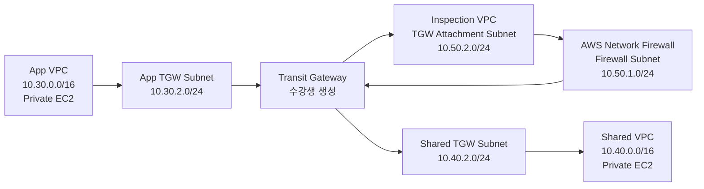

# 3일차 / TGW와 중앙 방화벽 Inspection 콘솔 실습 준비 랩

이 실습은 강사가 Terraform으로 App VPC, Shared VPC, Inspection VPC, 테스트 인스턴스, SSM 접속 환경만 미리 배포하고, 수강생이 AWS 콘솔에서 Transit Gateway와 AWS Network Firewall, 라우팅 경로를 직접 완성하도록 구성합니다.

중요한 제약이 있습니다. VPC Peering만으로는 `App VPC -> Firewall VPC -> Shared VPC`처럼 중간 VPC를 경유하는 통신을 만들 수 없습니다. VPC Peering은 transitive routing을 지원하지 않기 때문입니다. 그래서 중간 방화벽을 실제 경로에 삽입하려면 Transit Gateway, Inspection VPC, AWS Network Firewall 구조가 필요합니다.

Terraform은 다음 항목을 만들지 않습니다. 이 항목들이 수강생 실습 범위입니다.

- Transit Gateway
- TGW VPC attachment
- TGW route table, association, route
- AWS Network Firewall rule group
- AWS Network Firewall policy
- AWS Network Firewall
- VPC route table의 TGW 및 firewall endpoint route

## 1. 실습 아키텍처



## 2. 실습 목표

| 구분 | 결과 |
| --- | --- |
| Terraform 준비 직후 | App VPC와 Shared VPC 사이 통신 차단 |
| 수강생 작업 1 | Transit Gateway 생성 |
| 수강생 작업 2 | App, Shared, Inspection VPC attachment 생성 |
| 수강생 작업 3 | TGW route table association과 route 구성 |
| 수강생 작업 4 | Inspection VPC에 AWS Network Firewall 생성 |
| 수강생 작업 5 | VPC route table에서 TGW와 firewall endpoint 경로 구성 |
| 최종 테스트 | App EC2와 Shared EC2 간 private IP ping 성공 |
| 접속 방식 | Public IP 없이 SSM Session Manager 사용 |

EC2 Security Group은 ICMP 테스트가 가능하도록 Terraform에서 미리 열어 둡니다. 이 실습의 방화벽은 Security Group이 아니라 중간 경로에 삽입되는 AWS Network Firewall입니다.

## 3. Terraform 준비 리소스

| 리소스 | 구성 |
| --- | --- |
| VPC | App, Shared, Inspection |
| Subnet | App/Shared private subnet, App/Shared TGW attachment subnet, Inspection firewall subnet, Inspection TGW attachment subnet |
| Route Table | Workload private RT, Workload TGW attachment RT, Inspection firewall RT, Inspection TGW attachment RT |
| VPC Endpoint | App/Shared VPC에 SSM interface endpoint |
| EC2 | App/Shared VPC에 SSM 테스트 인스턴스 |
| IAM | SSM Session Manager용 instance profile |

## 4. 강사용 준비

```bash
terraform init
terraform apply
terraform output
```

이 레포의 helper를 사용할 수도 있습니다.

```bash
make plan LAB=terraform/fa01hc/day03-compute-and-network-security/08-vpc-peering-console-workshop
```

배포 후 수강생에게 다음 output 값을 전달합니다.

| Output | 용도 |
| --- | --- |
| `vpc_ids` | TGW attachment와 Network Firewall 생성 대상 VPC 확인 |
| `cidr_blocks` | Firewall rule group과 route table 입력 |
| `workload_subnet_ids` | App/Shared EC2 private subnet 확인 |
| `workload_tgw_subnet_ids` | App/Shared TGW attachment subnet 선택 |
| `inspection_subnet_ids` | Inspection TGW attachment subnet과 firewall subnet 선택 |
| `route_table_ids` | 수동 route 추가 대상 VPC route table |
| `suggested_console_names` | 수강생이 콘솔에서 만들 리소스 추천 이름 |
| `instance_ids` | SSM Session Manager 접속 대상 |
| `private_ips` | ping 테스트 대상 IP |

## 5. 수강생 실습

### 5.1 Transit Gateway 생성

1. AWS 콘솔에서 **VPC** 서비스로 이동합니다.
2. 왼쪽 메뉴에서 **Transit gateways**를 선택합니다.
3. **Create transit gateway**를 선택합니다.
4. 이름은 `suggested_console_names.tgw` 값을 사용합니다.
5. **Default route table association**을 비활성화합니다.
6. **Default route table propagation**을 비활성화합니다.
7. DNS support는 활성화 상태로 둡니다.
8. Transit Gateway를 생성하고 상태가 `Available`이 될 때까지 기다립니다.

### 5.2 TGW VPC Attachment 생성

왼쪽 메뉴에서 **Transit gateway attachments**를 선택하고 아래 3개 attachment를 생성합니다.

| Attachment | VPC | Subnet | Appliance mode |
| --- | --- | --- | --- |
| `suggested_console_names.tgw_app_attachment` | `vpc_ids.app` | `workload_tgw_subnet_ids.app` | 비활성화 |
| `suggested_console_names.tgw_shared_attachment` | `vpc_ids.shared` | `workload_tgw_subnet_ids.shared` | 비활성화 |
| `suggested_console_names.tgw_inspection_attachment` | `vpc_ids.inspection` | `inspection_subnet_ids.tgw` | 활성화 |

Inspection attachment에는 반드시 **Appliance mode support**를 활성화합니다. 중앙 방화벽 구조에서는 요청과 응답이 같은 방화벽 경로를 타야 하므로 이 설정이 중요합니다.

### 5.3 TGW Route Table 생성과 Association

왼쪽 메뉴에서 **Transit gateway route tables**를 선택하고 아래 2개 route table을 생성합니다.

| TGW Route Table | 용도 |
| --- | --- |
| `suggested_console_names.tgw_from_workloads_rt` | App/Shared VPC에서 출발한 트래픽을 Inspection VPC로 전달 |
| `suggested_console_names.tgw_from_inspection_rt` | Inspection VPC에서 돌아온 트래픽을 목적지 VPC로 전달 |

두 route table의 상태가 `Available`이 된 뒤 association을 진행합니다.

Route table association은 아래처럼 구성합니다.

| TGW Route Table | Associate attachment |
| --- | --- |
| `suggested_console_names.tgw_from_workloads_rt` | App attachment, Shared attachment |
| `suggested_console_names.tgw_from_inspection_rt` | Inspection attachment |

### 5.4 Network Firewall Rule Group 생성

1. 왼쪽 메뉴에서 **Network Firewall > Network Firewall rule groups**를 선택합니다.
2. **Create Network Firewall rule group**을 선택합니다.
3. Rule group type은 **Stateless rule group**을 선택합니다.
4. 이름은 `suggested_console_names.firewall_rule_group` 값을 사용합니다.
5. Capacity는 `100`으로 입력합니다.
6. Stateless rule을 추가합니다.

| 항목 | 값 |
| --- | --- |
| Priority | `100` |
| Protocol | `ICMP` |
| Source | `10.30.0.0/16`, `10.40.0.0/16` |
| Destination | `10.30.0.0/16`, `10.40.0.0/16` |
| Action | `Pass` |

이 규칙은 App VPC와 Shared VPC 사이 ICMP 테스트 트래픽만 통과시키는 단순 규칙입니다.

### 5.5 Firewall Policy 생성

1. 왼쪽 메뉴에서 **Network Firewall > Firewall policies**를 선택합니다.
2. **Create firewall policy**를 선택합니다.
3. 이름은 `suggested_console_names.firewall_policy` 값을 사용합니다.
4. Stateless rule group에 앞에서 만든 rule group을 추가합니다.
5. Stateless default actions는 **Drop**으로 둡니다.
6. Stateless fragment default actions도 **Drop**으로 둡니다.

### 5.6 Network Firewall 생성

1. 왼쪽 메뉴에서 **Network Firewall > Firewalls**를 선택합니다.
2. **Create firewall**을 선택합니다.
3. 이름은 `suggested_console_names.network_firewall` 값을 사용합니다.
4. VPC는 `vpc_ids.inspection` 값을 가진 Inspection VPC를 선택합니다.
5. Firewall policy는 앞에서 만든 policy를 선택합니다.
6. Subnet mapping에는 `inspection_subnet_ids.firewall` 값을 가진 firewall subnet을 선택합니다.
7. Firewall을 생성하고 상태가 `Ready`가 될 때까지 기다립니다.
8. Firewall 상세 화면에서 AZ별 **Endpoint ID**를 확인합니다. 이후 VPC route table에서 firewall endpoint target으로 사용합니다.

## 6. 라우팅 구성

라우팅은 반드시 양방향으로 맞아야 합니다. 아래 표의 모든 경로를 추가합니다.

### 6.1 Workload VPC Private Route Table

| Route Table | Destination | Target |
| --- | --- | --- |
| `route_table_ids.app_private` | `10.40.0.0/16` | 수강생이 만든 Transit Gateway |
| `route_table_ids.shared_private` | `10.30.0.0/16` | 수강생이 만든 Transit Gateway |

### 6.2 TGW Workload Route Table

`suggested_console_names.tgw_from_workloads_rt`에 다음 route를 추가합니다.

| Destination | Target attachment |
| --- | --- |
| `10.30.0.0/16` | Inspection attachment |
| `10.40.0.0/16` | Inspection attachment |

Workload에서 다른 Workload로 향하는 트래픽은 먼저 Inspection VPC attachment로 보내야 합니다.

### 6.3 Inspection VPC TGW Attachment Subnet Route Table

`route_table_ids.inspection_tgw`에 다음 route를 추가합니다.

| Destination | Target |
| --- | --- |
| `10.30.0.0/16` | Network Firewall endpoint ID |
| `10.40.0.0/16` | Network Firewall endpoint ID |

이 단계가 중간 방화벽 삽입의 핵심입니다. TGW attachment subnet으로 들어온 트래픽을 바로 TGW로 되돌리지 않고 Network Firewall endpoint로 보냅니다.

### 6.4 Inspection VPC Firewall Subnet Route Table

`route_table_ids.inspection_firewall`에 다음 route를 추가합니다.

| Destination | Target |
| --- | --- |
| `10.30.0.0/16` | 수강생이 만든 Transit Gateway |
| `10.40.0.0/16` | 수강생이 만든 Transit Gateway |

Firewall을 통과한 트래픽은 다시 Transit Gateway로 보내야 최종 목적지 VPC attachment로 전달됩니다.

### 6.5 TGW Inspection Route Table

`suggested_console_names.tgw_from_inspection_rt`에 다음 route를 추가합니다.

| Destination | Target attachment |
| --- | --- |
| `10.30.0.0/16` | App attachment |
| `10.40.0.0/16` | Shared attachment |

Inspection VPC에서 TGW로 돌아온 트래픽은 목적지 Workload VPC attachment로 보내야 합니다.

## 7. 통신 테스트

1. AWS 콘솔에서 **Systems Manager** 서비스로 이동합니다.
2. 왼쪽 메뉴에서 **Session Manager**를 선택합니다.
3. **Start session**을 선택합니다.
4. App 인스턴스를 선택하고 세션을 시작합니다.
5. Shared 인스턴스의 private IP로 ping을 실행합니다.

```bash
ping -c 3 <shared-private-ip>
```

정상이라면 `3 packets transmitted, 3 received` 형태가 출력됩니다.

반대 방향도 확인합니다.

```bash
ping -c 3 <app-private-ip>
```

## 8. 문제 해결

| 증상 | 확인할 항목 |
| --- | --- |
| Session Manager 대상이 보이지 않음 | EC2 running 상태와 SSM Agent Online 상태 확인 |
| TGW attachment가 route target으로 보이지 않음 | Attachment 상태가 `Available`인지 확인 |
| Network Firewall endpoint를 route target으로 선택할 수 없음 | Firewall 상태가 `Ready`인지 확인 |
| ping timeout | Workload private route table이 TGW를 가리키는지 확인 |
| ping timeout | TGW Workload route table이 Inspection attachment를 가리키는지 확인 |
| ping timeout | Inspection TGW attachment subnet route table이 Firewall endpoint를 가리키는지 확인 |
| ping timeout | Inspection Firewall subnet route table이 TGW를 가리키는지 확인 |
| ping timeout | TGW Inspection route table이 App/Shared attachment를 가리키는지 확인 |
| 한 방향만 성공 | 반대 방향 라우팅이 누락되었는지 확인 |

## 9. 정리

수강생이 콘솔에서 만든 항목은 Terraform state에 없으므로 먼저 콘솔에서 삭제합니다.

1. VPC route table에서 수동 추가 route 삭제
2. TGW route table에서 수동 추가 route 삭제
3. TGW route table association 해제
4. TGW VPC attachment 삭제
5. Transit Gateway 삭제
6. Network Firewall 삭제
7. Firewall policy 삭제
8. Firewall rule group 삭제

그 다음 강사가 Terraform 리소스를 삭제합니다.

```bash
terraform destroy
```

## 10. 실습 포인트

| 포인트 | 설명 |
| --- | --- |
| VPC Peering 한계 | Peering은 transitive routing을 지원하지 않아 중간 방화벽 VPC 경유 구조를 만들 수 없습니다. |
| TGW 직접 구성 | TGW, attachment, TGW route table을 수강생이 직접 만들면서 중앙 라우팅 구조를 이해합니다. |
| TGW Appliance Mode | Inspection VPC attachment에는 appliance mode를 켜서 대칭 경로를 유지합니다. |
| 방화벽 삽입 | TGW attachment subnet route table이 Network Firewall endpoint를 가리켜야 실제 경로에 방화벽이 들어갑니다. |
| 양방향 라우팅 | 요청과 응답 방향 모두 같은 inspection 경로를 통과해야 합니다. |
