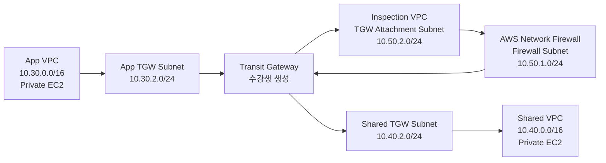

# 3일차 / TGW와 중앙 방화벽 Inspection AWS CLI 실습 준비 랩

이 실습은 강사가 Terraform으로 App VPC, Shared VPC, Inspection VPC, 테스트 인스턴스, SSM 접속 환경만 미리 배포하고, 수강생이 AWS CLI로 Transit Gateway, AWS Network Firewall, 라우팅 경로를 직접 완성하도록 구성합니다.

중요한 제약이 있습니다. VPC Peering만으로는 `App VPC -> Firewall VPC -> Shared VPC`처럼 중간 VPC를 경유하는 통신을 만들 수 없습니다. VPC Peering은 transitive routing을 지원하지 않기 때문입니다. 그래서 중간 방화벽을 실제 경로에 삽입하려면 Transit Gateway, Inspection VPC, AWS Network Firewall 구조가 필요합니다.

Terraform은 다음 항목을 만들지 않습니다. 이 항목들이 수강생 실습 범위입니다.

- Transit Gateway
- TGW VPC attachment
- TGW route table, association, route
- AWS Network Firewall rule group
- AWS Network Firewall policy
- AWS Network Firewall
- VPC route table의 TGW 및 firewall endpoint route

## 1. 실습 아키텍처



## 2. 실습 목표

| 구분 | 결과 |
| --- | --- |
| Terraform 준비 직후 | App VPC와 Shared VPC 사이 통신 차단 |
| 수강생 작업 1 | Transit Gateway 생성 |
| 수강생 작업 2 | App, Shared, Inspection VPC attachment 생성 |
| 수강생 작업 3 | TGW route table association과 route 구성 |
| 수강생 작업 4 | Inspection VPC에 AWS Network Firewall 생성 |
| 수강생 작업 5 | VPC route table에서 TGW와 firewall endpoint 경로 구성 |
| 최종 테스트 | App EC2와 Shared EC2 간 private IP ping 성공 |
| 접속 방식 | Public IP 없이 SSM Run Command 또는 Session Manager 사용 |

EC2 Security Group은 ICMP 테스트가 가능하도록 Terraform에서 미리 열어 둡니다. 이 실습의 방화벽은 Security Group이 아니라 중간 경로에 삽입되는 AWS Network Firewall입니다.

## 3. Terraform 준비 리소스

| 리소스 | 구성 |
| --- | --- |
| VPC | App, Shared, Inspection |
| Subnet | App/Shared private subnet, App/Shared TGW attachment subnet, Inspection firewall subnet, Inspection TGW attachment subnet |
| Route Table | Workload private RT, Workload TGW attachment RT, Inspection firewall RT, Inspection TGW attachment RT |
| VPC Endpoint | App/Shared VPC에 SSM interface endpoint |
| EC2 | App/Shared VPC에 SSM 테스트 인스턴스 |
| IAM | SSM Session Manager용 instance profile |

## 4. 실습 전 확인

이 가이드는 bash 또는 zsh 기준입니다. 모든 명령은 `us-east-1`에서 실행합니다.

```bash
aws --version
terraform version

export AWS_PAGER=""
export AWS_REGION=us-east-1
```

AWS CLI 자격 증명이 아직 설정되어 있지 않다면 실습 계정의 Access key를 profile로 먼저 등록합니다.

```bash
aws configure --profile fa01hc
```

입력값은 실습 계정 CSV의 값을 사용합니다.

| 항목 | 입력값 |
| --- | --- |
| AWS Access Key ID | CSV의 `Access key ID` |
| AWS Secret Access Key | CSV의 `Secret access key` |
| Default region name | `us-east-1` |
| Default output format | `json` |

CSV에 session token이 포함된 임시 자격 증명이라면 아래 명령도 추가로 실행합니다.

```bash
aws configure set aws_session_token "CSV의 session token 값" --profile fa01hc
```

이 터미널에서 Terraform과 AWS CLI가 같은 profile을 쓰도록 지정합니다.

```bash
export AWS_PROFILE=fa01hc

aws sts get-caller-identity
```

`aws sts get-caller-identity`가 account, user ARN을 출력해야 다음 단계로 진행합니다. 여기서 `No valid credential sources found` 또는 `Unable to locate credentials`가 나오면 Terraform도 같은 이유로 실패합니다.

Network Firewall과 Transit Gateway는 생성 시간 동안 비용이 발생합니다. 실습이 끝나면 반드시 정리 절차를 완료합니다.

## 5. 강사용 Terraform 준비

```bash
git clone https://github.com/gasbugs/mulcam-aws-cloud-security-terraform.git
cd mulcam-aws-cloud-security-terraform

LAB_DIR=terraform/fa01hc/day03-compute-and-network-security/08-vpc-peering-console-workshop
cd "$LAB_DIR"

terraform init
terraform apply
```

`terraform apply`가 생성 계획을 보여주면 `yes`를 입력합니다.

수강생 CLI 실습에 필요한 값을 shell 환경변수 파일로 저장합니다.

```bash
terraform output -raw cli_export_commands > /tmp/fa01hc-inspection-firewall.env
source /tmp/fa01hc-inspection-firewall.env

env | grep -E '^(APP_|SHARED_|INSPECTION_|TGW_|FIREWALL_|NETWORK_|AWS_REGION=|PROJECT_NAME=)' | sort
```

강사는 `/tmp/fa01hc-inspection-firewall.env` 내용을 수강생에게 전달하거나, 수강생이 같은 Terraform 디렉토리에서 위 명령을 직접 실행하게 합니다.

Terraform apply 직후에는 EC2 instance profile과 SSM endpoint DNS 인식이 늦을 수 있습니다. App/Shared 인스턴스를 한 번 재부팅한 뒤 SSM Online 상태를 확인합니다.

```bash
aws ec2 reboot-instances \
  --instance-ids "$APP_INSTANCE_ID" "$SHARED_INSTANCE_ID" \
  --region "$AWS_REGION"

aws ec2 wait instance-status-ok \
  --instance-ids "$APP_INSTANCE_ID" "$SHARED_INSTANCE_ID" \
  --region "$AWS_REGION"
```

```bash
wait_ssm_online() {
  local instance_id="$1"
  local status=""

  for i in {1..40}; do
    status=$(aws ssm describe-instance-information \
      --filters "Key=InstanceIds,Values=$instance_id" \
      --query "InstanceInformationList[0].PingStatus" \
      --output text \
      --region "$AWS_REGION")

    echo "$instance_id $status"

    if [ "$status" = "Online" ]; then
      return 0
    fi

    sleep 15
  done

  echo "SSM Agent가 Online 상태가 아닙니다: $instance_id $status"
  return 1
}

wait_ssm_online "$APP_INSTANCE_ID"
wait_ssm_online "$SHARED_INSTANCE_ID"
```

## 6. Transit Gateway 생성

```bash
TGW_ID=$(aws ec2 create-transit-gateway \
  --description "$PROJECT_NAME centralized inspection transit gateway" \
  --options "AmazonSideAsn=64512,AutoAcceptSharedAttachments=disable,DefaultRouteTableAssociation=disable,DefaultRouteTablePropagation=disable,DnsSupport=enable,VpnEcmpSupport=enable" \
  --tag-specifications "ResourceType=transit-gateway,Tags=[{Key=Name,Value=$TGW_NAME},{Key=Course,Value=FA01HC},{Key=Unit,Value=inspection-firewall-cli}]" \
  --query "TransitGateway.TransitGatewayId" \
  --output text \
  --region "$AWS_REGION")

echo "$TGW_ID"
```

Transit Gateway가 `available` 상태가 될 때까지 기다립니다.

```bash
for i in {1..40}; do
  TGW_STATE=$(aws ec2 describe-transit-gateways \
    --transit-gateway-ids "$TGW_ID" \
    --query "TransitGateways[0].State" \
    --output text \
    --region "$AWS_REGION")

  echo "$TGW_STATE"

  if [ "$TGW_STATE" = "available" ]; then
    break
  fi

  sleep 15
done

if [ "$TGW_STATE" != "available" ]; then
  echo "Transit Gateway 상태를 확인하세요: $TGW_STATE"
  exit 1
fi
```

## 7. TGW VPC Attachment 생성

App VPC와 Shared VPC attachment는 일반 모드로 만들고, Inspection VPC attachment는 반드시 appliance mode를 활성화합니다. 중앙 방화벽 구조에서는 요청과 응답이 같은 방화벽 경로를 타야 하므로 이 설정이 중요합니다.

```bash
APP_TGW_ATTACHMENT_ID=$(aws ec2 create-transit-gateway-vpc-attachment \
  --transit-gateway-id "$TGW_ID" \
  --vpc-id "$APP_VPC_ID" \
  --subnet-ids "$APP_TGW_SUBNET_ID" \
  --options "DnsSupport=enable,SecurityGroupReferencingSupport=disable,Ipv6Support=disable,ApplianceModeSupport=disable" \
  --tag-specifications "ResourceType=transit-gateway-attachment,Tags=[{Key=Name,Value=$TGW_APP_ATTACHMENT_NAME},{Key=Course,Value=FA01HC},{Key=Unit,Value=inspection-firewall-cli}]" \
  --query "TransitGatewayVpcAttachment.TransitGatewayAttachmentId" \
  --output text \
  --region "$AWS_REGION")

SHARED_TGW_ATTACHMENT_ID=$(aws ec2 create-transit-gateway-vpc-attachment \
  --transit-gateway-id "$TGW_ID" \
  --vpc-id "$SHARED_VPC_ID" \
  --subnet-ids "$SHARED_TGW_SUBNET_ID" \
  --options "DnsSupport=enable,SecurityGroupReferencingSupport=disable,Ipv6Support=disable,ApplianceModeSupport=disable" \
  --tag-specifications "ResourceType=transit-gateway-attachment,Tags=[{Key=Name,Value=$TGW_SHARED_ATTACHMENT_NAME},{Key=Course,Value=FA01HC},{Key=Unit,Value=inspection-firewall-cli}]" \
  --query "TransitGatewayVpcAttachment.TransitGatewayAttachmentId" \
  --output text \
  --region "$AWS_REGION")

INSPECTION_TGW_ATTACHMENT_ID=$(aws ec2 create-transit-gateway-vpc-attachment \
  --transit-gateway-id "$TGW_ID" \
  --vpc-id "$INSPECTION_VPC_ID" \
  --subnet-ids "$INSPECTION_TGW_SUBNET_ID" \
  --options "DnsSupport=enable,SecurityGroupReferencingSupport=disable,Ipv6Support=disable,ApplianceModeSupport=enable" \
  --tag-specifications "ResourceType=transit-gateway-attachment,Tags=[{Key=Name,Value=$TGW_INSPECTION_ATTACHMENT_NAME},{Key=Course,Value=FA01HC},{Key=Unit,Value=inspection-firewall-cli}]" \
  --query "TransitGatewayVpcAttachment.TransitGatewayAttachmentId" \
  --output text \
  --region "$AWS_REGION")

printf "%s\n" "$APP_TGW_ATTACHMENT_ID" "$SHARED_TGW_ATTACHMENT_ID" "$INSPECTION_TGW_ATTACHMENT_ID"
```

Attachment가 `available` 상태가 될 때까지 기다립니다.

```bash
wait_tgw_attachment_available() {
  local attachment_id="$1"
  local state=""

  for i in {1..40}; do
    state=$(aws ec2 describe-transit-gateway-vpc-attachments \
      --transit-gateway-attachment-ids "$attachment_id" \
      --query "TransitGatewayVpcAttachments[0].State" \
      --output text \
      --region "$AWS_REGION")

    echo "$attachment_id $state"

    if [ "$state" = "available" ]; then
      return 0
    fi

    if [ "$state" = "failed" ] || [ "$state" = "rejected" ]; then
      echo "TGW attachment 생성 실패: $attachment_id $state"
      return 1
    fi

    sleep 15
  done

  echo "TGW attachment 상태를 확인하세요: $attachment_id $state"
  return 1
}

wait_tgw_attachment_available "$APP_TGW_ATTACHMENT_ID"
wait_tgw_attachment_available "$SHARED_TGW_ATTACHMENT_ID"
wait_tgw_attachment_available "$INSPECTION_TGW_ATTACHMENT_ID"
```

## 8. TGW Route Table 생성과 Association

```bash
WORKLOAD_TGW_RT_ID=$(aws ec2 create-transit-gateway-route-table \
  --transit-gateway-id "$TGW_ID" \
  --tag-specifications "ResourceType=transit-gateway-route-table,Tags=[{Key=Name,Value=$TGW_FROM_WORKLOADS_RT_NAME},{Key=Course,Value=FA01HC},{Key=Unit,Value=inspection-firewall-cli}]" \
  --query "TransitGatewayRouteTable.TransitGatewayRouteTableId" \
  --output text \
  --region "$AWS_REGION")

INSPECTION_TGW_RT_ID_STUDENT=$(aws ec2 create-transit-gateway-route-table \
  --transit-gateway-id "$TGW_ID" \
  --tag-specifications "ResourceType=transit-gateway-route-table,Tags=[{Key=Name,Value=$TGW_FROM_INSPECTION_RT_NAME},{Key=Course,Value=FA01HC},{Key=Unit,Value=inspection-firewall-cli}]" \
  --query "TransitGatewayRouteTable.TransitGatewayRouteTableId" \
  --output text \
  --region "$AWS_REGION")

printf "%s\n" "$WORKLOAD_TGW_RT_ID" "$INSPECTION_TGW_RT_ID_STUDENT"
```

TGW route table이 `available` 상태가 될 때까지 기다립니다.

```bash
wait_tgw_route_table_available() {
  local route_table_id="$1"
  local state=""

  for i in {1..40}; do
    state=$(aws ec2 describe-transit-gateway-route-tables \
      --transit-gateway-route-table-ids "$route_table_id" \
      --query "TransitGatewayRouteTables[0].State" \
      --output text \
      --region "$AWS_REGION")

    echo "$route_table_id $state"

    if [ "$state" = "available" ]; then
      return 0
    fi

    if [ "$state" = "failed" ] || [ "$state" = "deleted" ]; then
      echo "TGW route table 상태를 확인하세요: $route_table_id $state"
      return 1
    fi

    sleep 10
  done

  echo "TGW route table available 대기 시간이 초과되었습니다: $route_table_id $state"
  return 1
}

wait_tgw_route_table_available "$WORKLOAD_TGW_RT_ID"
wait_tgw_route_table_available "$INSPECTION_TGW_RT_ID_STUDENT"
```

App/Shared attachment는 workload용 TGW route table에 연결하고, Inspection attachment는 inspection용 TGW route table에 연결합니다.

```bash
aws ec2 associate-transit-gateway-route-table \
  --transit-gateway-route-table-id "$WORKLOAD_TGW_RT_ID" \
  --transit-gateway-attachment-id "$APP_TGW_ATTACHMENT_ID" \
  --region "$AWS_REGION"

aws ec2 associate-transit-gateway-route-table \
  --transit-gateway-route-table-id "$WORKLOAD_TGW_RT_ID" \
  --transit-gateway-attachment-id "$SHARED_TGW_ATTACHMENT_ID" \
  --region "$AWS_REGION"

aws ec2 associate-transit-gateway-route-table \
  --transit-gateway-route-table-id "$INSPECTION_TGW_RT_ID_STUDENT" \
  --transit-gateway-attachment-id "$INSPECTION_TGW_ATTACHMENT_ID" \
  --region "$AWS_REGION"
```

## 9. Network Firewall Rule Group 생성

App VPC와 Shared VPC 사이 ICMP 트래픽만 통과시키는 stateful rule group을 만듭니다.

```bash
cat > /tmp/fa01hc-icmp-stateful-rule-group.json <<EOF
{
  "RulesSource": {
    "RulesString": "pass icmp $APP_CIDR any -> $SHARED_CIDR any (msg:\"Allow app to shared ICMP\"; sid:1001; rev:1;)\\npass icmp $SHARED_CIDR any -> $APP_CIDR any (msg:\"Allow shared to app ICMP\"; sid:1002; rev:1;)"
  },
  "StatefulRuleOptions": {
    "RuleOrder": "STRICT_ORDER"
  }
}
EOF

RULE_GROUP_ARN=$(aws network-firewall create-rule-group \
  --rule-group-name "$FIREWALL_RULE_GROUP_NAME" \
  --type STATEFUL \
  --capacity 100 \
  --rule-group file:///tmp/fa01hc-icmp-stateful-rule-group.json \
  --tags Key=Course,Value=FA01HC Key=Unit,Value=inspection-firewall-cli \
  --query "RuleGroupResponse.RuleGroupArn" \
  --output text \
  --region "$AWS_REGION")

echo "$RULE_GROUP_ARN"
```

## 10. Firewall Policy 생성

```bash
cat > /tmp/fa01hc-firewall-policy.json <<EOF
{
  "StatelessDefaultActions": ["aws:forward_to_sfe"],
  "StatelessFragmentDefaultActions": ["aws:forward_to_sfe"],
  "StatefulEngineOptions": {
    "RuleOrder": "STRICT_ORDER"
  },
  "StatefulDefaultActions": ["aws:drop_strict"],
  "StatefulRuleGroupReferences": [
    {
      "ResourceArn": "$RULE_GROUP_ARN",
      "Priority": 100
    }
  ]
}
EOF

FIREWALL_POLICY_ARN=$(aws network-firewall create-firewall-policy \
  --firewall-policy-name "$FIREWALL_POLICY_NAME" \
  --firewall-policy file:///tmp/fa01hc-firewall-policy.json \
  --tags Key=Course,Value=FA01HC Key=Unit,Value=inspection-firewall-cli \
  --query "FirewallPolicyResponse.FirewallPolicyArn" \
  --output text \
  --region "$AWS_REGION")

echo "$FIREWALL_POLICY_ARN"
```

## 11. Network Firewall 생성

Inspection VPC의 firewall subnet에 Network Firewall endpoint를 만듭니다.

```bash
FIREWALL_ARN=$(aws network-firewall create-firewall \
  --firewall-name "$NETWORK_FIREWALL_NAME" \
  --firewall-policy-arn "$FIREWALL_POLICY_ARN" \
  --vpc-id "$INSPECTION_VPC_ID" \
  --subnet-mappings "SubnetId=$INSPECTION_FIREWALL_SUBNET_ID" \
  --no-delete-protection \
  --no-subnet-change-protection \
  --no-firewall-policy-change-protection \
  --tags Key=Course,Value=FA01HC Key=Unit,Value=inspection-firewall-cli \
  --query "Firewall.FirewallArn" \
  --output text \
  --region "$AWS_REGION")

echo "$FIREWALL_ARN"
```

Firewall과 endpoint가 `READY` 상태가 될 때까지 기다립니다.

```bash
for i in {1..60}; do
  FIREWALL_STATUS=$(aws network-firewall describe-firewall \
    --firewall-name "$NETWORK_FIREWALL_NAME" \
    --query "FirewallStatus.Status" \
    --output text \
    --region "$AWS_REGION")

  FIREWALL_ENDPOINT_STATUS=$(aws network-firewall describe-firewall \
    --firewall-name "$NETWORK_FIREWALL_NAME" \
    --query "FirewallStatus.SyncStates.\"$INSPECTION_FIREWALL_AZ\".Attachment.Status" \
    --output text \
    --region "$AWS_REGION")

  echo "$FIREWALL_STATUS $FIREWALL_ENDPOINT_STATUS"

  if [ "$FIREWALL_STATUS" = "READY" ] && [ "$FIREWALL_ENDPOINT_STATUS" = "READY" ]; then
    break
  fi

  sleep 20
done

if [ "$FIREWALL_STATUS" != "READY" ] || [ "$FIREWALL_ENDPOINT_STATUS" != "READY" ]; then
  echo "Network Firewall 상태를 확인하세요: $FIREWALL_STATUS $FIREWALL_ENDPOINT_STATUS"
  exit 1
fi
```

VPC route table의 firewall endpoint target으로 사용할 endpoint ID를 가져옵니다.

```bash
FIREWALL_ENDPOINT_ID=$(aws network-firewall describe-firewall \
  --firewall-name "$NETWORK_FIREWALL_NAME" \
  --query "FirewallStatus.SyncStates.\"$INSPECTION_FIREWALL_AZ\".Attachment.EndpointId" \
  --output text \
  --region "$AWS_REGION")

echo "$FIREWALL_ENDPOINT_ID"
```

## 12. 라우팅 구성

라우팅은 반드시 양방향으로 맞아야 합니다. 아래 명령 전체를 실행합니다.

### 12.1 Workload VPC private route table

App VPC에서 Shared VPC로, Shared VPC에서 App VPC로 향하는 트래픽을 TGW로 보냅니다.

```bash
aws ec2 create-route \
  --route-table-id "$APP_PRIVATE_RT_ID" \
  --destination-cidr-block "$SHARED_CIDR" \
  --transit-gateway-id "$TGW_ID" \
  --region "$AWS_REGION"

aws ec2 create-route \
  --route-table-id "$SHARED_PRIVATE_RT_ID" \
  --destination-cidr-block "$APP_CIDR" \
  --transit-gateway-id "$TGW_ID" \
  --region "$AWS_REGION"
```

### 12.2 TGW workload route table

Workload에서 출발한 트래픽은 먼저 Inspection VPC attachment로 보내야 합니다.

```bash
aws ec2 create-transit-gateway-route \
  --transit-gateway-route-table-id "$WORKLOAD_TGW_RT_ID" \
  --destination-cidr-block "0.0.0.0/0" \
  --transit-gateway-attachment-id "$INSPECTION_TGW_ATTACHMENT_ID" \
  --region "$AWS_REGION"
```

### 12.3 Inspection VPC TGW attachment subnet route table

TGW attachment subnet으로 들어온 트래픽을 바로 TGW로 되돌리지 않고 Network Firewall endpoint로 보냅니다.

```bash
aws ec2 create-route \
  --route-table-id "$INSPECTION_TGW_RT_ID" \
  --destination-cidr-block "0.0.0.0/0" \
  --vpc-endpoint-id "$FIREWALL_ENDPOINT_ID" \
  --region "$AWS_REGION"
```

### 12.4 Inspection VPC firewall subnet route table

Firewall을 통과한 트래픽은 다시 Transit Gateway로 보내야 최종 목적지 VPC attachment로 전달됩니다.

```bash
aws ec2 create-route \
  --route-table-id "$INSPECTION_FIREWALL_RT_ID" \
  --destination-cidr-block "0.0.0.0/0" \
  --transit-gateway-id "$TGW_ID" \
  --region "$AWS_REGION"
```

### 12.5 TGW inspection route table

Inspection VPC에서 TGW로 돌아온 트래픽은 목적지 Workload VPC attachment로 보냅니다.

```bash
aws ec2 create-transit-gateway-route \
  --transit-gateway-route-table-id "$INSPECTION_TGW_RT_ID_STUDENT" \
  --destination-cidr-block "$APP_CIDR" \
  --transit-gateway-attachment-id "$APP_TGW_ATTACHMENT_ID" \
  --region "$AWS_REGION"

aws ec2 create-transit-gateway-route \
  --transit-gateway-route-table-id "$INSPECTION_TGW_RT_ID_STUDENT" \
  --destination-cidr-block "$SHARED_CIDR" \
  --transit-gateway-attachment-id "$SHARED_TGW_ATTACHMENT_ID" \
  --region "$AWS_REGION"
```

### 12.6 Route 상태 확인과 안정화 대기

TGW route table association과 VPC route가 데이터 플레인에 반영될 시간을 잠시 둡니다.

```bash
aws ec2 describe-route-tables \
  --route-table-ids "$APP_PRIVATE_RT_ID" "$SHARED_PRIVATE_RT_ID" "$INSPECTION_TGW_RT_ID" "$INSPECTION_FIREWALL_RT_ID" \
  --query "RouteTables[].{RouteTableId:RouteTableId,Routes:Routes[].{Destination:DestinationCidrBlock,TransitGatewayId:TransitGatewayId,VpcEndpointId:VpcEndpointId,State:State}}" \
  --output table \
  --region "$AWS_REGION"

aws ec2 search-transit-gateway-routes \
  --transit-gateway-route-table-id "$WORKLOAD_TGW_RT_ID" \
  --filters "Name=state,Values=active" \
  --query "Routes[].{Destination:DestinationCidrBlock,Attachment:TransitGatewayAttachments[0].TransitGatewayAttachmentId,State:State}" \
  --output table \
  --region "$AWS_REGION"

aws ec2 search-transit-gateway-routes \
  --transit-gateway-route-table-id "$INSPECTION_TGW_RT_ID_STUDENT" \
  --filters "Name=state,Values=active" \
  --query "Routes[].{Destination:DestinationCidrBlock,Attachment:TransitGatewayAttachments[0].TransitGatewayAttachmentId,State:State}" \
  --output table \
  --region "$AWS_REGION"

sleep 120
```

## 13. 통신 테스트

Session Manager shell을 열지 않고 SSM Run Command로 ping을 실행합니다. Network Firewall endpoint와 TGW route가 반영된 직후에는 첫 번째 ping이 실패할 수 있으므로 1분 간격으로 재시도합니다.

```bash
run_ping_until_success() {
  local source_instance_id="$1"
  local destination_ip="$2"
  local label="$3"
  local command_id=""
  local status=""

  for attempt in {1..10}; do
    echo "ping $label attempt $attempt"

    command_id=$(aws ssm send-command \
      --instance-ids "$source_instance_id" \
      --document-name "AWS-RunShellScript" \
      --parameters "commands=ping -c 5 $destination_ip" \
      --query "Command.CommandId" \
      --output text \
      --region "$AWS_REGION")

    aws ssm wait command-executed \
      --command-id "$command_id" \
      --instance-id "$source_instance_id" \
      --region "$AWS_REGION" || true

    aws ssm get-command-invocation \
      --command-id "$command_id" \
      --instance-id "$source_instance_id" \
      --query "StandardOutputContent" \
      --output text \
      --region "$AWS_REGION"

    aws ssm get-command-invocation \
      --command-id "$command_id" \
      --instance-id "$source_instance_id" \
      --query "StandardErrorContent" \
      --output text \
      --region "$AWS_REGION"

    status=$(aws ssm get-command-invocation \
      --command-id "$command_id" \
      --instance-id "$source_instance_id" \
      --query "Status" \
      --output text \
      --region "$AWS_REGION")

    if [ "$status" = "Success" ]; then
      return 0
    fi

    sleep 60
  done

  return 1
}

run_ping_until_success "$APP_INSTANCE_ID" "$SHARED_PRIVATE_IP" "app -> shared"
run_ping_until_success "$SHARED_INSTANCE_ID" "$APP_PRIVATE_IP" "shared -> app"
```

정상이라면 `5 packets transmitted, 5 received` 또는 일부 초기 packet loss 이후 `received`가 1개 이상 있는 형태가 출력됩니다.

## 14. 상태 확인 명령

```bash
aws ec2 describe-transit-gateway-vpc-attachments \
  --transit-gateway-attachment-ids "$APP_TGW_ATTACHMENT_ID" "$SHARED_TGW_ATTACHMENT_ID" "$INSPECTION_TGW_ATTACHMENT_ID" \
  --query "TransitGatewayVpcAttachments[].{Id:TransitGatewayAttachmentId,State:State,VpcId:VpcId}" \
  --output table \
  --region "$AWS_REGION"

aws network-firewall describe-firewall \
  --firewall-name "$NETWORK_FIREWALL_NAME" \
  --query "FirewallStatus.{Status:Status,Sync:ConfigurationSyncStateSummary,Endpoint:SyncStates}" \
  --output table \
  --region "$AWS_REGION"
```

## 15. 문제 해결

| 증상 | 확인할 항목 |
| --- | --- |
| SSM 명령이 실패함 | EC2 running 상태, SSM Agent Online 상태, Terraform이 만든 SSM endpoint 상태 확인 |
| TGW attachment가 `available`이 아님 | attachment subnet ID와 VPC ID가 올바른지 확인 |
| Network Firewall이 `READY`가 아님 | firewall subnet, firewall policy ARN, rule group 상태 확인 |
| `FIREWALL_ENDPOINT_ID`가 `None` | Firewall endpoint attachment 상태가 `READY`가 될 때까지 대기 |
| ping timeout | Workload private route table이 TGW를 가리키는지 확인 |
| ping timeout | TGW workload route table이 Inspection attachment를 가리키는지 확인 |
| ping timeout | Inspection TGW attachment subnet route table이 Firewall endpoint를 가리키는지 확인 |
| ping timeout | Inspection firewall subnet route table이 TGW를 가리키는지 확인 |
| ping timeout | TGW inspection route table이 App/Shared attachment를 가리키는지 확인 |
| 한 방향만 성공 | 반대 방향 라우팅이 누락되었는지 확인 |

## 16. AWS CLI로 직접 만든 리소스 정리

수강생이 AWS CLI로 만든 리소스는 Terraform state에 없습니다. 먼저 CLI 리소스를 삭제하고, 마지막에 Terraform 리소스를 삭제합니다.

동일 터미널이 아니라면 먼저 환경변수를 다시 불러옵니다.

```bash
source /tmp/fa01hc-inspection-firewall.env
export AWS_PAGER=""
```

동적으로 생성한 TGW 관련 ID 변수가 없다면 이름 태그로 다시 조회합니다.

```bash
TGW_ID=${TGW_ID:-$(aws ec2 describe-transit-gateways \
  --filters "Name=tag:Name,Values=$TGW_NAME" \
  --query "TransitGateways[?State!='deleted'].TransitGatewayId | [0]" \
  --output text \
  --region "$AWS_REGION")}

APP_TGW_ATTACHMENT_ID=${APP_TGW_ATTACHMENT_ID:-$(aws ec2 describe-transit-gateway-vpc-attachments \
  --filters "Name=tag:Name,Values=$TGW_APP_ATTACHMENT_NAME" \
  --query "TransitGatewayVpcAttachments[?State!='deleted'].TransitGatewayAttachmentId | [0]" \
  --output text \
  --region "$AWS_REGION")}

SHARED_TGW_ATTACHMENT_ID=${SHARED_TGW_ATTACHMENT_ID:-$(aws ec2 describe-transit-gateway-vpc-attachments \
  --filters "Name=tag:Name,Values=$TGW_SHARED_ATTACHMENT_NAME" \
  --query "TransitGatewayVpcAttachments[?State!='deleted'].TransitGatewayAttachmentId | [0]" \
  --output text \
  --region "$AWS_REGION")}

INSPECTION_TGW_ATTACHMENT_ID=${INSPECTION_TGW_ATTACHMENT_ID:-$(aws ec2 describe-transit-gateway-vpc-attachments \
  --filters "Name=tag:Name,Values=$TGW_INSPECTION_ATTACHMENT_NAME" \
  --query "TransitGatewayVpcAttachments[?State!='deleted'].TransitGatewayAttachmentId | [0]" \
  --output text \
  --region "$AWS_REGION")}

WORKLOAD_TGW_RT_ID=${WORKLOAD_TGW_RT_ID:-$(aws ec2 describe-transit-gateway-route-tables \
  --filters "Name=tag:Name,Values=$TGW_FROM_WORKLOADS_RT_NAME" \
  --query "TransitGatewayRouteTables[?State!='deleted'].TransitGatewayRouteTableId | [0]" \
  --output text \
  --region "$AWS_REGION")}

INSPECTION_TGW_RT_ID_STUDENT=${INSPECTION_TGW_RT_ID_STUDENT:-$(aws ec2 describe-transit-gateway-route-tables \
  --filters "Name=tag:Name,Values=$TGW_FROM_INSPECTION_RT_NAME" \
  --query "TransitGatewayRouteTables[?State!='deleted'].TransitGatewayRouteTableId | [0]" \
  --output text \
  --region "$AWS_REGION")}
```

VPC route와 TGW route를 삭제합니다.

```bash
aws ec2 delete-route --route-table-id "$APP_PRIVATE_RT_ID" --destination-cidr-block "$SHARED_CIDR" --region "$AWS_REGION" || true
aws ec2 delete-route --route-table-id "$SHARED_PRIVATE_RT_ID" --destination-cidr-block "$APP_CIDR" --region "$AWS_REGION" || true
aws ec2 delete-route --route-table-id "$INSPECTION_TGW_RT_ID" --destination-cidr-block "0.0.0.0/0" --region "$AWS_REGION" || true
aws ec2 delete-route --route-table-id "$INSPECTION_FIREWALL_RT_ID" --destination-cidr-block "0.0.0.0/0" --region "$AWS_REGION" || true

aws ec2 delete-transit-gateway-route --transit-gateway-route-table-id "$WORKLOAD_TGW_RT_ID" --destination-cidr-block "0.0.0.0/0" --region "$AWS_REGION" || true
aws ec2 delete-transit-gateway-route --transit-gateway-route-table-id "$INSPECTION_TGW_RT_ID_STUDENT" --destination-cidr-block "$APP_CIDR" --region "$AWS_REGION" || true
aws ec2 delete-transit-gateway-route --transit-gateway-route-table-id "$INSPECTION_TGW_RT_ID_STUDENT" --destination-cidr-block "$SHARED_CIDR" --region "$AWS_REGION" || true
```

TGW route table association을 해제합니다.

```bash
aws ec2 disassociate-transit-gateway-route-table --transit-gateway-route-table-id "$WORKLOAD_TGW_RT_ID" --transit-gateway-attachment-id "$APP_TGW_ATTACHMENT_ID" --region "$AWS_REGION" || true
aws ec2 disassociate-transit-gateway-route-table --transit-gateway-route-table-id "$WORKLOAD_TGW_RT_ID" --transit-gateway-attachment-id "$SHARED_TGW_ATTACHMENT_ID" --region "$AWS_REGION" || true
aws ec2 disassociate-transit-gateway-route-table --transit-gateway-route-table-id "$INSPECTION_TGW_RT_ID_STUDENT" --transit-gateway-attachment-id "$INSPECTION_TGW_ATTACHMENT_ID" --region "$AWS_REGION" || true
```

Network Firewall을 삭제합니다.

```bash
aws network-firewall delete-firewall \
  --firewall-name "$NETWORK_FIREWALL_NAME" \
  --region "$AWS_REGION" || true

for i in {1..40}; do
  if ! aws network-firewall describe-firewall \
    --firewall-name "$NETWORK_FIREWALL_NAME" \
    --region "$AWS_REGION" >/dev/null 2>&1; then
    break
  fi

  echo "waiting for firewall deletion"
  sleep 30
done

aws network-firewall delete-firewall-policy \
  --firewall-policy-name "$FIREWALL_POLICY_NAME" \
  --region "$AWS_REGION" || true

aws network-firewall delete-rule-group \
  --rule-group-name "$FIREWALL_RULE_GROUP_NAME" \
  --type STATEFUL \
  --region "$AWS_REGION" || true
```

TGW attachment, TGW route table, TGW를 삭제합니다.

```bash
aws ec2 delete-transit-gateway-vpc-attachment --transit-gateway-attachment-id "$APP_TGW_ATTACHMENT_ID" --region "$AWS_REGION" || true
aws ec2 delete-transit-gateway-vpc-attachment --transit-gateway-attachment-id "$SHARED_TGW_ATTACHMENT_ID" --region "$AWS_REGION" || true
aws ec2 delete-transit-gateway-vpc-attachment --transit-gateway-attachment-id "$INSPECTION_TGW_ATTACHMENT_ID" --region "$AWS_REGION" || true

wait_tgw_attachment_deleted() {
  local attachment_id="$1"
  local state=""

  for i in {1..40}; do
    state=$(aws ec2 describe-transit-gateway-vpc-attachments \
      --transit-gateway-attachment-ids "$attachment_id" \
      --query "TransitGatewayVpcAttachments[0].State" \
      --output text \
      --region "$AWS_REGION" 2>/dev/null || echo "deleted")

    echo "$attachment_id $state"

    if [ "$state" = "deleted" ] || [ "$state" = "None" ] || [ "$state" = "failed" ]; then
      return 0
    fi

    sleep 15
  done

  echo "TGW attachment 삭제 상태를 확인하세요: $attachment_id $state"
  return 1
}

wait_tgw_attachment_deleted "$APP_TGW_ATTACHMENT_ID"
wait_tgw_attachment_deleted "$SHARED_TGW_ATTACHMENT_ID"
wait_tgw_attachment_deleted "$INSPECTION_TGW_ATTACHMENT_ID"

aws ec2 delete-transit-gateway-route-table --transit-gateway-route-table-id "$WORKLOAD_TGW_RT_ID" --region "$AWS_REGION" || true
aws ec2 delete-transit-gateway-route-table --transit-gateway-route-table-id "$INSPECTION_TGW_RT_ID_STUDENT" --region "$AWS_REGION" || true

aws ec2 delete-transit-gateway \
  --transit-gateway-id "$TGW_ID" \
  --region "$AWS_REGION" || true
```

마지막으로 Terraform 리소스를 삭제합니다.

```bash
terraform destroy
```

## 17. 실습 포인트

| 포인트 | 설명 |
| --- | --- |
| VPC Peering 한계 | Peering은 transitive routing을 지원하지 않아 중간 방화벽 VPC 경유 구조를 만들 수 없습니다. |
| TGW 직접 구성 | TGW, attachment, TGW route table을 CLI로 만들면서 중앙 라우팅 구조를 이해합니다. |
| TGW Appliance Mode | Inspection VPC attachment에는 appliance mode를 켜서 대칭 경로를 유지합니다. |
| 방화벽 삽입 | TGW attachment subnet route table이 Network Firewall endpoint를 가리켜야 실제 경로에 방화벽이 들어갑니다. |
| 양방향 라우팅 | 요청과 응답 방향 모두 같은 inspection 경로를 통과해야 합니다. |
