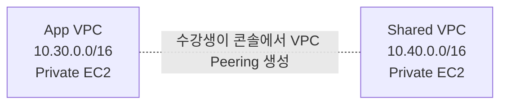

# 3일차 / VPC Peering 콘솔 실습 준비 랩

이 실습은 강사가 Terraform으로 기본 VPC 환경을 미리 배포하고, 수강생은 AWS 콘솔에서 VPC Peering과 방화벽(Security Group) 연결만 직접 완성하도록 구성합니다.

Terraform은 Peering Connection, Peering Route, ICMP 인바운드 Security Group Rule을 만들지 않습니다. 이 세 가지가 수강생 실습 범위입니다.

## 1. 실습 아키텍처



## 2. 실습 목표

| 구분 | 결과 |
| --- | --- |
| Terraform 준비 직후 | 두 VPC 사이 통신 차단 |
| 수강생 작업 1 | VPC Peering 생성 및 수락 |
| 수강생 작업 2 | 양쪽 Route Table에 상대 VPC CIDR 경로 추가 |
| 수강생 작업 3 | 양쪽 EC2 Security Group에 상대 VPC CIDR의 ICMP 허용 |
| 최종 테스트 | App EC2와 Shared EC2 간 private IP ping 성공 |
| 접속 방식 | Public IP 없이 SSM Session Manager 사용 |

이 랩에서 방화벽은 EC2 인스턴스에 연결된 Security Group을 의미합니다. Network ACL은 기본 허용 상태를 유지하고, 수강생은 Security Group 인바운드 규칙만 수정합니다.

## 3. Terraform 준비 리소스

| 리소스 | 구성 |
| --- | --- |
| VPC | App VPC 1개, Shared VPC 1개 |
| Subnet | VPC별 private subnet 1개 |
| Route Table | VPC별 private route table 1개 |
| Security Group | VPC별 테스트 인스턴스용 SG 1개, SSM Endpoint용 SG 1개 |
| VPC Endpoint | VPC별 `ssm`, `ssmmessages`, `ec2messages` interface endpoint |
| EC2 | VPC별 SSM 테스트 인스턴스 1대 |
| IAM | SSM Session Manager용 instance profile |

## 4. 강사용 준비

```bash
terraform init
terraform apply
terraform output
```

이 레포의 helper를 사용할 수도 있습니다.

```bash
make plan LAB=terraform/fa01hc/day03-compute-and-network-security/08-vpc-peering-console-workshop
```

배포 후 수강생에게 다음 output 값을 전달합니다.

| Output | 용도 |
| --- | --- |
| `vpc_ids` | Peering 생성 시 requester/accepter VPC 선택 |
| `cidr_blocks` | Route Table과 Security Group 규칙 입력 |
| `route_table_ids` | Peering route를 추가할 대상 |
| `security_group_ids` | ICMP inbound rule을 추가할 대상 |
| `instance_ids` | SSM Session Manager 접속 대상 |
| `private_ips` | ping 테스트 대상 IP |

## 5. 수강생 실습

### 5.1 VPC Peering 생성

1. AWS 콘솔에서 **VPC** 서비스로 이동합니다.
2. 왼쪽 메뉴에서 **Peering connections**를 선택합니다.
3. **Create peering connection**을 선택합니다.
4. Name tag에 `fa01hc-vpc-peering-console-app-to-shared`를 입력합니다.
5. VPC requester에서 `app` VPC ID를 선택합니다.
6. Account는 **My account**, Region은 **This Region**을 선택합니다.
7. VPC accepter에서 `shared` VPC ID를 선택합니다.
8. Peering connection을 생성합니다.
9. 생성된 Peering connection을 선택하고 **Actions > Accept request**를 선택합니다.
10. 상태가 `Active`가 될 때까지 기다립니다.

### 5.2 Route Table 경로 추가

왼쪽 메뉴에서 **Route tables**를 선택하고 Terraform output의 `route_table_ids` 값을 기준으로 두 route table을 수정합니다.

| Route Table | Destination | Target |
| --- | --- | --- |
| App private route table | `10.40.0.0/16` | 생성한 VPC Peering connection |
| Shared private route table | `10.30.0.0/16` | 생성한 VPC Peering connection |

각 route table에서 **Routes > Edit routes > Add route**를 선택해 위 경로를 추가합니다.

### 5.3 Security Group 방화벽 규칙 추가

왼쪽 메뉴에서 **Security Groups**를 선택하고 Terraform output의 `security_group_ids` 값을 기준으로 두 Security Group을 수정합니다.

| Security Group | Type | Source |
| --- | --- | --- |
| App instance SG | All ICMP - IPv4 | `10.40.0.0/16` |
| Shared instance SG | All ICMP - IPv4 | `10.30.0.0/16` |

각 Security Group에서 **Inbound rules > Edit inbound rules > Add rule**을 선택해 위 규칙을 추가합니다.

### 5.4 SSM Session Manager로 테스트

1. AWS 콘솔에서 **Systems Manager** 서비스로 이동합니다.
2. 왼쪽 메뉴에서 **Session Manager**를 선택합니다.
3. **Start session**을 선택합니다.
4. App 인스턴스를 선택하고 세션을 시작합니다.
5. Shared 인스턴스의 private IP로 ping을 실행합니다.

```bash
ping -c 3 <shared-private-ip>
```

정상이라면 `3 packets transmitted, 3 received` 형태가 출력됩니다.

반대 방향도 확인하려면 Shared 인스턴스에 접속해 App 인스턴스의 private IP로 ping을 실행합니다.

```bash
ping -c 3 <app-private-ip>
```

## 6. 문제 해결

| 증상 | 확인할 항목 |
| --- | --- |
| Session Manager 대상이 보이지 않음 | EC2가 running 상태인지, SSM Agent가 Online인지 2~5분 기다린 뒤 재확인 |
| ping timeout | Peering 상태가 `Active`인지 확인 |
| ping timeout | 양쪽 Route Table에 상대 VPC CIDR 경로가 있는지 확인 |
| ping timeout | 양쪽 Security Group inbound rule에 상대 VPC CIDR ICMP 허용이 있는지 확인 |
| Route 추가 시 target 선택 불가 | Peering connection이 아직 `Active`인지 확인 |

## 7. 정리

수강생이 콘솔에서 만든 항목은 Terraform state에 없으므로 먼저 콘솔에서 삭제합니다.

1. 양쪽 Route Table에서 Peering route 삭제
2. 양쪽 Security Group에서 ICMP inbound rule 삭제
3. VPC Peering connection 삭제

그 다음 강사가 Terraform 리소스를 삭제합니다.

```bash
terraform destroy
```

## 8. 실습 포인트

| 포인트 | 설명 |
| --- | --- |
| CIDR 중복 방지 | VPC Peering은 CIDR이 겹치면 라우팅할 수 없습니다. |
| 양방향 라우팅 | Peering은 연결만으로 통신되지 않고 양쪽 Route Table 경로가 필요합니다. |
| Security Group | 라우팅이 맞아도 인스턴스 방화벽이 막으면 통신되지 않습니다. |
| Private 통신 | Public IP 없이 VPC 간 private IP로 통신합니다. |
